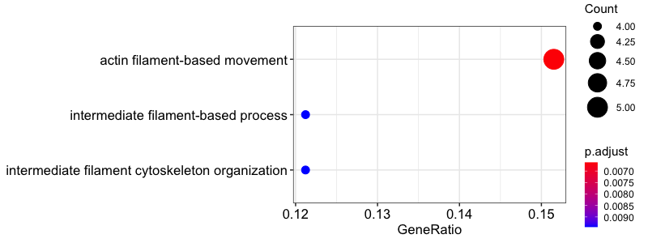
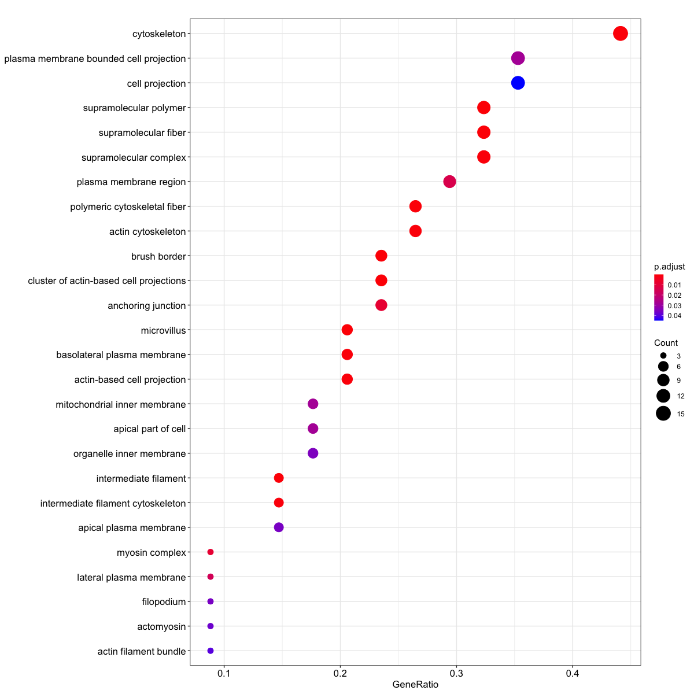
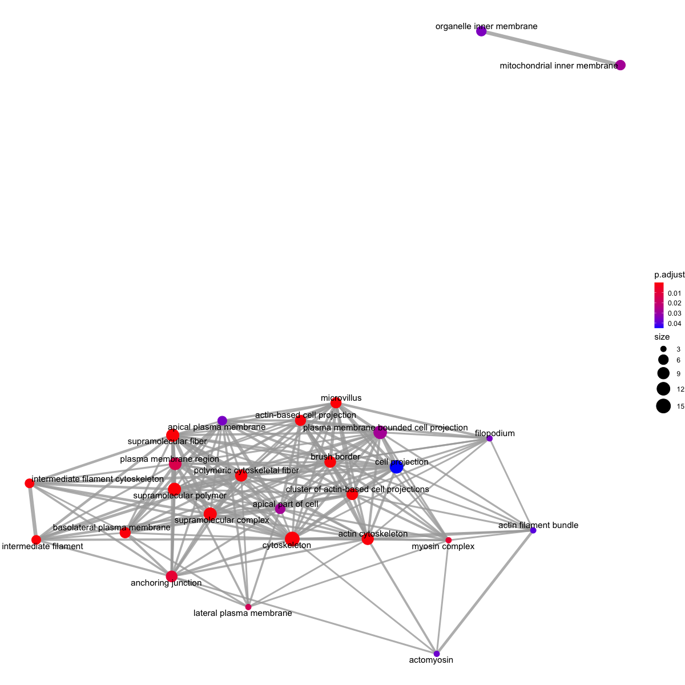
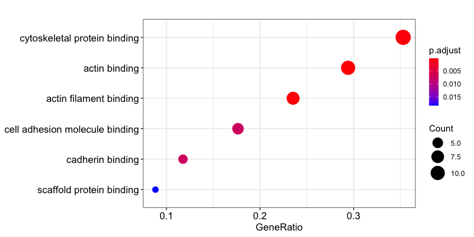
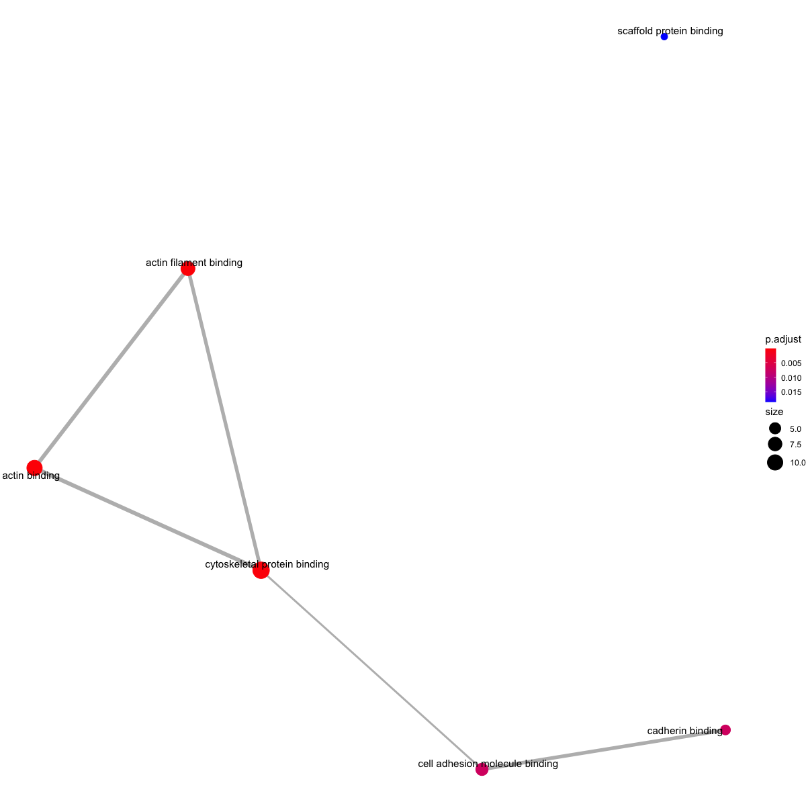

```{r setup, include=FALSE}
knitr::opts_chunk$set(echo = TRUE)
```
  
## Library Loading for the analysis
```{r message=FALSE, warning=FALSE}
options(connectionObserver = NULL)

library(ensembldb)
library(EnsDb.Mmusculus.v79)
library(org.Mm.eg.db)
library(AnnotationDbi)
library(data.table)
library(tidyverse)
library(rtracklayer)
library(Rsamtools)
library(DESeq2)
library(Rsubread)
library(VennDiagram)
library(CLIPanalyze)
library(RColorBrewer)
library(gplots)
library(Biostrings)
library(pheatmap)
library(ggrepel)
library(rvest)
library(ggseqlogo)
library(gridExtra)
```

## Analysis for the HF sample CLIP data
Load the `rds` file from HF_1/2/3 3 sample CLIP analysis and use MA plot to visuaize that sequence depth are balanced between CLIP and IC libraries, and the peaks that were called.
```{r}
dir.create("PDF_figure", showWarnings = FALSE)

peak.data.hf<- readRDS("~/OneDrive - Harvard University/Haigis Lab/Projects/Halo-Ago2/Halo-Ago-KRas/Raw Data/HEAP-CLIP/HEAP_12232019/Analysis/CLIP_Analysis/Data Visualization/peakdata.HF.rds")

plotMA(peak.data.hf$gene.counts.nopeaks,
       main = "MA plot for HF HEAP vs IC\n in genes outside peaks")

pdf("PDF_figure/MAPlot_HF_HEAPvIC_OutsidePeaks.pdf",
    height = 4,
    width = 5)
plotMA(peak.data.hf$gene.counts.nopeaks,
       main = "MA plot for HF HEAP vs IC\n in genes outside peaks")
dev.off()

plotMA(peak.data.hf$res.deseq,
       main = "MA plot for HF HEAP vs IC in peaks,\none-sided test")

pdf("PDF_figure/MAPlot_HF_HEAPvIC_InPeaks.pdf",
    height = 4,
    width = 5)
plotMA(peak.data.hf$res.deseq,
       main = "MA plot for HF HEAP vs IC in peaks,\none-sided test")
dev.off()
```

Prepare the peak, assign scores to HF peaks by adjusted p-value.
```{r}
peaks.all.hf <- peak.data.hf$peaks
peaks.all.hf <- subset(peaks.all.hf, width > 20)
peaks.all.hf <- subset(peaks.all.hf, log2FC > 0)
peaks.all.hf <- keepStandardChromosomes(peaks.all.hf)
score(peaks.all.hf) <- -log10(peaks.all.hf$padj)
length(peaks.all.hf)
summary(width(peaks.all.hf))

count.threshold <- 10
norm.counts <- counts(peak.data.hf$peak.counts, normalized = TRUE)
norm.counts <- norm.counts[names(peaks.all.hf), ]
colnames(norm.counts)[1:6] <- c(paste0("HF", 1:3), paste0("HF-IC", 1:3))
selected.peaks <- rowMeans(norm.counts[, paste0("HF", 1:3)]) > count.threshold 
peaks.all.hf <- peaks.all.hf[selected.peaks, ]

length(peaks.all.hf)
summary(width(peaks.all.hf))
```
Count fraction of peaks in genomic features for top N peaks selected by p-value of enrichment in WT HEAP-CLIP vs. input:
```{r}
countFeatures <- function(peaks, top.n, ignore.intergenic = FALSE) {
    peak.subset <- peaks
    if (ignore.intergenic) {
        peak.subset <- subset(peak.subset, annot != "intergenic")
    }
    peak.subset <- subset(peak.subset, rank(-peak.subset$score) <= top.n)
    table(peak.subset$annot) / length(peak.subset)
}
npeaks <- seq(1, 15) * 100
feature.frac.hf.peaks <-
    sapply(npeaks, function(x) countFeatures(peaks.all.hf, x))
colnames(feature.frac.hf.peaks) <- npeaks

write.csv(as.data.frame(feature.frac.hf.peaks), "feature_frac_hf_peaks.csv")

for (feature in c("utr3", "utr5", "exon", "intron", "intergenic")) {
    plot(colnames(feature.frac.hf.peaks), feature.frac.hf.peaks[feature, ],
         type = "o",
         main = sprintf("fraction of HF peaks in %s", feature),
         xlab = "top N peaks by adjusted p-value",
         ylab = sprintf("fraction of peaks in %s", feature))
}

pdf("PDF_figure/Fraction_of_HF_peaks.pdf",
    height = 4,
    width = 5)
for (feature in c("utr3", "utr5", "exon", "intron", "intergenic")) {
    plot(colnames(feature.frac.hf.peaks), feature.frac.hf.peaks[feature, ],
         type = "o",
         main = sprintf("fraction of HF peaks in %s", feature),
         xlab = "top N peaks by adjusted p-value",
         ylab = sprintf("fraction of peaks in %s", feature))
}
dev.off()
```

Select peaks significantly enriched over input and are in 3'UTR for further analysis.
```{r}
padj.threshold <- 5*1e-2
hf.peaks <- subset(peaks.all.hf, padj < padj.threshold)
score(hf.peaks) <- -log10(hf.peaks$padj)
hf.peaks$input.log2FC <- hf.peaks$log2FC
hf.peaks$input.padj <- hf.peaks$padj
hf.peaks$log2FC <- NULL
hf.peaks$padj <- NULL
saveRDS(hf.peaks, "peaks-HF-selected.rds")
length(hf.peaks)
summary(width(hf.peaks))
peaks.hf.utr3 <- subset(hf.peaks, annot =="utr3")
length(peaks.hf.utr3)
```

## Analysis for the HFK sample CLIP data {#hfkclip}
Load the `rds` file from HFK sample CLIP analysis and use MA plot to visuaize that sequence depth are balanced between CLIP and IC libraries, and the peaks that were called.

```{r}
peak.data.hfk<- readRDS("~/OneDrive - Harvard University/Haigis Lab/Projects/Halo-Ago2/Halo-Ago-KRas/Raw Data/HEAP-CLIP/HEAP_12232019/Analysis/CLIP_Analysis/Data Visualization/peakdata.HFK.rds")

plotMA(peak.data.hfk$gene.counts.nopeaks,
       main = "MA plot for HFK HEAP vs IC\n in genes outside peaks")

pdf("PDF_figure/MAPlot_HFK_HEAPvIC_OutsidePeaks.pdf",
    height = 4,
    width = 5)
plotMA(peak.data.hfk$gene.counts.nopeaks,
       main = "MA plot for HFK HEAP vs IC\n in genes outside peaks")
dev.off()

plotMA(peak.data.hfk$res.deseq,
       main = "MA plot for HFK HEAP vs IC in peaks,\none-sided test")

pdf("PDF_figure/MAPlot_HFK_HEAPvIC_InPeaks.pdf",
    height = 4,
    width = 5)
plotMA(peak.data.hfk$res.deseq,
       main = "MA plot for HFK HEAP vs IC in peaks,\none-sided test")
dev.off()
```

Prepare the peak, assign scores to KRas peaks by adjusted p-value.
```{r}
peaks.all.hfk <- peak.data.hfk$peaks
peaks.all.hfk <- subset(peaks.all.hfk, width > 20)
peaks.all.hfk <- subset(peaks.all.hfk, log2FC > 0)
peaks.all.hfk <- keepStandardChromosomes(peaks.all.hfk)
score(peaks.all.hfk) <- -log10(peaks.all.hfk$padj)
length(peaks.all.hfk)
summary(width(peaks.all.hfk))

norm.counts <- counts(peak.data.hfk$peak.counts, normalized = TRUE)
norm.counts <- norm.counts[names(peaks.all.hfk), ]
colnames(norm.counts)[1:6] <- c(paste0("HFK", 1:3), paste0("HFK-IC", 1:3))
selected.peaks <- rowMeans(norm.counts[, paste0("HFK", 1:3)]) > count.threshold 
peaks.all.hfk <- peaks.all.hfk[selected.peaks, ]

length(peaks.all.hfk)
summary(width(peaks.all.hfk))
```
Count fraction of peaks in genomic features for top N peaks selected by p-value of enrichment in WT HEAP-CLIP vs. input:
```{r, eval = FALSE}
countFeatures <- function(peaks, top.n, ignore.intergenic = FALSE) {
    peak.subset <- peaks
    if (ignore.intergenic) {
        peak.subset <- subset(peak.subset, annot != "intergenic")
    }
    peak.subset <- subset(peak.subset, rank(-peak.subset$score) <= top.n)
    table(peak.subset$annot) / length(peak.subset)
}
npeaks <- seq(1, 14) * 500
feature.frac.hfk.peaks <-
    sapply(npeaks, function(x) countFeatures(peaks.all.hfk, x))
colnames(feature.frac.hfk.peaks) <- npeaks

write.csv(as.data.frame(feature.frac.hfk.peaks), "feature_frac_hfk_peaks.csv")


for (feature in c("utr3", "utr5", "exon", "intron", "intergenic")) {
    plot(colnames(feature.frac.hfk.peaks), feature.frac.hfk.peaks[feature, ],
         type = "o",
         main = sprintf("fraction of HFK peaks in %s", feature),
         xlab = "top N peaks by adjusted p-value",
         ylab = sprintf("fraction of peaks in %s", feature))
}

pdf("PDF_figure/Fraction_of_HFK_peaks.pdf",
    height = 4,
    width = 5)
for (feature in c("utr3", "utr5", "exon", "intron", "intergenic")) {
    plot(colnames(feature.frac.hfk.peaks), feature.frac.hfk.peaks[feature, ],
         type = "o",
         main = sprintf("fraction of HFK peaks in %s", feature),
         xlab = "top N peaks by adjusted p-value",
         ylab = sprintf("fraction of peaks in %s", feature))
}
dev.off()
```
Select peaks significantly enriched over input and are in 3'UTR for further analysis.
```{r}
padj.threshold <- 5*1e-2
hfk.peaks <- subset(peaks.all.hfk, padj < padj.threshold)
score(hfk.peaks) <- -log10(hfk.peaks$padj)
hfk.peaks$input.log2FC <- hfk.peaks$log2FC
hfk.peaks$input.padj <- hfk.peaks$padj
hfk.peaks$log2FC <- NULL
hfk.peaks$padj <- NULL
saveRDS(hfk.peaks, "peaks-HFK-selected.rds")
length(hfk.peaks)
summary(width(hfk.peaks))
peaks.hfk.utr3 <- subset(hfk.peaks, annot =="utr3")
length(peaks.hfk.utr3)
```

## Cross analysis of HF and HFK CLIP results {#crossclip}
Venndiagram for mapping all overlapping peaks that have a LFC > 0 and padj < 0.05 between the HF and HFK samples
```{r}
peaks.overlap <- subsetByOverlaps(hf.peaks, hfk.peaks)
length(peaks.overlap)

grid.newpage()
draw.pairwise.venn(length(hfk.peaks),
                   length(hf.peaks),
                   length(peaks.overlap),
                   catergory <- c("HEAP-CLIP Peaks \nHFK",
                                  "HEAP-CLIP Peaks \nHF"),
                   lty = "blank",
                   ex.text = FALSE,
                   fill = c("pink", "lightblue"),
                   cat.pos = c(200, 135), cat.dist = 0.08, margin = 0.05,
                   fontfamily = "sans", cat.fontfamily = "sans")

pdf("PDF_figure/Venn_HF_HFK_peaks.pdf",
    width = 8,
    height = 6)
draw.pairwise.venn(length(hfk.peaks),
                   length(hf.peaks),
                   length(peaks.overlap),
                   catergory <- c("HEAP-CLIP Peaks \nHFK",
                                  "HEAP-CLIP Peaks \nHF"),
                   lty = "blank",
                   ex.text = FALSE,
                   fill = c("pink", "lightblue"),
                   cat.pos = c(200, 135), cat.dist = 0.08, margin = 0.05,
                   fontfamily = "sans", cat.fontfamily = "sans")
dev.off()

```
Venndiagram for mapping overlapping peaks in 3' UTR that have a LFC > 0, padj < 0.05, and are in 3' UTR between the HF and HFK samples
```{r}
peaks.utr3.overlap <- subsetByOverlaps(peaks.hf.utr3, peaks.hfk.utr3)
length(peaks.utr3.overlap)

grid.newpage()
draw.pairwise.venn(length(peaks.hfk.utr3),
                  length(peaks.hf.utr3),
                  length(peaks.utr3.overlap),
                  catergory <- c("HEAP-CLIP Peaks \nHFK \nin 3' UTR",
                                 "HEAP-CLIP Peaks \nHF \nin 3' UTR"),
                  lty = "blank",
                  ex.text = FALSE,
                  fill = c("pink", "lightblue"),
                  cat.pos = c(250, 135), cat.dist = 0.1, margin = 0.1,
                  fontfamily = "sans", cat.fontfamily = "sans")

pdf("PDF_figure/Venn_HF_HFK_peaks_3UTR.pdf",
    width = 8,
    height = 6)
draw.pairwise.venn(length(peaks.hfk.utr3),
                  length(peaks.hf.utr3),
                  length(peaks.utr3.overlap),
                  catergory <- c("HEAP-CLIP Peaks \nHFK \nin 3' UTR",
                                 "HEAP-CLIP Peaks \nHF \nin 3' UTR"),
                  lty = "blank",
                  ex.text = FALSE,
                  fill = c("pink", "lightblue"),
                  cat.pos = c(250, 135), cat.dist = 0.1, margin = 0.1,
                  fontfamily = "sans", cat.fontfamily = "sans")
dev.off()
```

## Cross analysis with HEAP-CLIP data and proteomics and transcriptomics data {#proteinrna}
### Idnetify HF and HFK specific peaks
This analysis is done on all peaks from all regions of the genome since I decided not to limit the analysis on 3'UTR peaks.
```{r}
hf.specific.peaks <- hf.peaks[!hf.peaks %over% hfk.peaks,]
hfk.specific.peaks <- hfk.peaks[!hfk.peaks %over% hf.peaks,]
```

### How many genes targeted by HF and HFK specific peaks are detected in proteomics
Get a list of genes that are targeted by HF and HFK specific miRNA peaks in their 3' UTR regions. Obtain matched Ensembl gene ID for these genes using AnnotationDbi package. Obtain matching Uniprot ID information using AnnotationDbi package as well as BioMart on Ensembl.
```{r}
# obtain the list of gene names
hf.uniq.peaks <- as.data.frame(hf.specific.peaks)
hfk.uniq.peaks <- as.data.frame(hfk.specific.peaks)
```

#### Annotate peaks with Ensembl ID and Uniprot ID
First we need to nnotate each peak with its potential target gene, 3'UTR annotation gets priority.
```{r}
## HF
hf.uniq.peaks$'target_gene' <- NA
for (i in 1:dim(hf.uniq.peaks)) {
  if (!is.na(hf.uniq.peaks[i,12]) | !is.na(hf.uniq.peaks[i,13])) {
    gene_name <- unique(unlist(hf.uniq.peaks[i,12:13]))
    gene_name <- gene_name[!is.na(gene_name)] 
    hf.uniq.peaks$'target_gene'[i] <- paste(unlist(gene_name), collapse = " ")
  }
  else {
    gene_name <- unique(unlist(hf.uniq.peaks[i,8:11]))
    gene_name <- gene_name[!is.na(gene_name)]
    if (length(gene_name) >0) {
    hf.uniq.peaks$'target_gene'[i] <- paste(unlist(gene_name), collapse = " ")
    }
  }
}

hf_gene_list <- as.data.frame(table(hf.uniq.peaks$target_gene))
write.csv(hf_gene_list, 'HF_uniq_target.csv')

## HFK
hfk.uniq.peaks$'target_gene' <- NA
for (i in 1:dim(hfk.uniq.peaks)) {
  if (!is.na(hfk.uniq.peaks[i,12]) | !is.na(hfk.uniq.peaks[i,13])) {
    gene_name <- unique(unlist(hfk.uniq.peaks[i,12:13]))
    gene_name <- gene_name[!is.na(gene_name)] 
    hfk.uniq.peaks$'target_gene'[i] <- paste(unlist(gene_name), collapse = " ")
  }
  else {
    gene_name <- unique(unlist(hfk.uniq.peaks[i,8:11]))
    gene_name <- gene_name[!is.na(gene_name)]
    if (length(gene_name) >0) {
    hfk.uniq.peaks$'target_gene'[i] <- paste(unlist(gene_name), collapse = " ")
    }
  }
}

hfk_gene_list <- as.data.frame(table(hfk.uniq.peaks$target_gene))
write.csv(hfk_gene_list, 'HFK_uniq_target.csv')
```
Try using AnnotationDbi to convert gene name annotations to Ensembl ID and Uniprot ID
```{r}
# HF
# Ensembl IDs are annotated using `EnsDb.Mmusculus.v79` package since that is the one that I used for RNA-Seq analysis
annotations_hf <- AnnotationDbi::select(EnsDb.Mmusculus.v79,
                                           keys = as.character(hf_gene_list$Var1),
                                           columns = c("GENEID", "UNIPROTID"),
                                           keytype = "GENENAME")

# Determine the indices for the non-duplicated genes
non_duplicates_idx <- which(duplicated(annotations_hf$UNIPROTID) == FALSE)
non_duplicates_idx <- which(duplicated(annotations_hf$GENEID) == FALSE)

# Return only the non-duplicated genes using indices
annotations_hf <- annotations_hf[non_duplicates_idx, ]

# Check number of NAs returned
is.na(annotations_hf$GENENAME) %>%
  which() %>%
  length()

# annotate the dataset with Ensembl ID
hf.uniq.peaks <- inner_join(hf.uniq.peaks, annotations_hf, by=c("target_gene"="GENENAME"))
colnames(hf.uniq.peaks)[22] <- "UNIPROTID_Annot" 

# how many genes have Ensembl ID
sum(!is.na(annotations_hf$GENEID))

# Now I need to acquire a list of UNIPROT ID from Uniprot website retrieval for the same list of target genes
# load the gene name to Uniprot ID conversion table
genename2UniprotID <- read.csv('~/OneDrive - Harvard University/Haigis Lab/Projects/Halo-Ago2/Halo-Ago-KRas/Raw Data/HEAP-CLIP/HEAP_12232019/Analysis/CLIP_Analysis/Data Visualization/genename2uniprot_HF.csv')
genename2UniprotID$gene_entry <- as.character(genename2UniprotID$gene_entry)
genename2UniprotID$Entry <- as.character(genename2UniprotID$Entry)

hf.uniq.peaks$UNIPROTID_Web <- NA
for (i in 1:dim(hf.uniq.peaks)[1]) {
  peak.index <- grep(paste("^",hf.uniq.peaks$target_gene[i],"$", sep=""), genename2UniprotID$gene_entry)
  if (length(genename2UniprotID$Entry[peak.index]) != 0) {
      hf.uniq.peaks$UNIPROTID_Web[i] <- paste(genename2UniprotID$Entry[peak.index], collapse = " ")
  }
}

# manually annotate peaks that had no matched Uniprot ID in SwissProt, using the top hit with the corresponding gene name
no_id_list <- as.data.frame(dimnames(table(hf.uniq.peaks$target_gene[is.na(hf.uniq.peaks$UNIPROTID_Web)])))
write.csv(no_id_list, "no.UniprotID.list.HF.csv")

# load the new list that has manually input Uniprot IDs for no ID genes and annotate the peak file
no_id_list_ID_hf <- read.csv('~/OneDrive - Harvard University/Haigis Lab/Projects/Halo-Ago2/Halo-Ago-KRas/Raw Data/HEAP-CLIP/HEAP_12232019/Analysis/CLIP_Analysis/Data Visualization/no.UniprotID.list_2_Uniprot_HF.csv')

for (i in 1:dim(hf.uniq.peaks)[1]) {
  peak.index <- grep(paste("^",hf.uniq.peaks$target_gene[i],"$", sep=""), no_id_list_ID_hf$gene_names)
  if (length(no_id_list_ID_hf$UniprotID[peak.index]) != 0) {
      hf.uniq.peaks$UNIPROTID_Web[i] <- paste(no_id_list_ID_hf$UniprotID[peak.index], collapse = " ")
  }
}

# how many genes have Uniprot ID
dim(table(hf.uniq.peaks$UNIPROTID_Web))[1]
```

Now we load the enema model colon tumor proteomics files and see how much overlap we get between HF specific peaks and proteomics.
```{r}
proteom_quant <- read.csv('~/OneDrive - Harvard University/Haigis Lab/Projects/Halo-Ago2/Halo-Ago-KRas/Raw Data/Proteomics data/scraped colon/2015-03_HaigisMouseColon8plex_Prot.csv')
proteom_de <- read.csv("~/OneDrive - Harvard University/Haigis Lab/Projects/Halo-Ago2/Halo-Ago-KRas/Raw Data/Proteomics data/scraped colon/ceMS_diff.csv")

# check how many HF specific HEAP targets are detected in proteomics using AnnotationDbi Uniprot Annotation
hf_detected_proteome <- intersect(hf.uniq.peaks$UNIPROTID_Annot, proteom_quant$Protein.Id)
length(hf_detected_proteome)

# check how many HF specific HEAP targets are detected in proteomics using Uniprot Website Uniprot Annotation
hf_detected_proteome <- intersect(hf.uniq.peaks$UNIPROTID_Web, proteom_quant$Protein.Id)
length(hf_detected_proteome)
```
This shows that annotation using Uniprot website ID retrieval is far superior than using `AnnotationDbi` package annotated Uniprot ID using `EnsDb.Mmusculus.v79` database. So I will also use Uniprot website to annotate the HFK target list with Uniprot ID. 

So now we annotate the HFK target list with Ensembl ID and Uniprot ID.
```{r}
# HFK
# Ensembl IDs are annotated using `EnsDb.Mmusculus.v79` package since that is the one that I used for RNA-Seq analysis
annotations_hfk <- AnnotationDbi::select(EnsDb.Mmusculus.v79,
                                           keys = as.character(hfk_gene_list$Var1),
                                           columns = c("GENEID"),
                                           keytype = "GENENAME")

# Determine the indices for the non-duplicated genes
non_duplicates_idx <- which(duplicated(annotations_hfk$UNIPROTID) == FALSE)
non_duplicates_idx <- which(duplicated(annotations_hfk$GENEID) == FALSE)

# Return only the non-duplicated genes using indices
annotations_hfk <- annotations_hfk[non_duplicates_idx, ]

# Check number of NAs returned
is.na(annotations_hfk$GENENAME) %>%
  which() %>%
  length()

# annotate the dataset with Ensembl ID
hfk.uniq.peaks <- inner_join(hfk.uniq.peaks, annotations_hfk, by=c("target_gene"="GENENAME"))

# Now I need to acquire a list of UNIPROT ID from Uniprot website retrieval for the same list of target genes
# load the gene name to Uniprot ID conversion table
genename2UniprotID_hfk <- read.csv('~/OneDrive - Harvard University/Haigis Lab/Projects/Halo-Ago2/Halo-Ago-KRas/Raw Data/HEAP-CLIP/HEAP_12232019/Analysis/CLIP_Analysis/Data Visualization/genename2uniprot_HFK.csv')
genename2UniprotID_hfk$gene_entry <- as.character(genename2UniprotID_hfk$gene_entry)
genename2UniprotID_hfk$Entry <- as.character(genename2UniprotID_hfk$Entry)

hfk.uniq.peaks$UNIPROTID <- NA
for (i in 1:dim(hfk.uniq.peaks)[1]) {
  peak.index <- grep(paste("^",hfk.uniq.peaks$target_gene[i],"$", sep=""), genename2UniprotID_hfk$gene_entry)
  if (length(genename2UniprotID_hfk$Entry[peak.index]) != 0) {
      hfk.uniq.peaks$UNIPROTID[i] <- paste(genename2UniprotID_hfk$Entry[peak.index], collapse = " ")
  }
}

# manually annotate peaks that had no matched Uniprot ID in SwissProt, using the top hit with the corresponding gene name
no_id_list_hfk <- as.data.frame(dimnames(table(hfk.uniq.peaks$target_gene[is.na(hfk.uniq.peaks$UNIPROTID)])))
write.csv(no_id_list_hfk, "no.UniprotID.list_HFK.csv")

# load the new list that has manually input Uniprot IDs for no ID genes and annotate the peak file
no_id_list_ID_hfk <- read.csv('~/OneDrive - Harvard University/Haigis Lab/Projects/Halo-Ago2/Halo-Ago-KRas/Raw Data/HEAP-CLIP/HEAP_12232019/Analysis/CLIP_Analysis/Data Visualization/no.UniprotID.list_2_Uniprot_HFK.csv', col.names = FALSE)

for (i in 1:dim(hfk.uniq.peaks)[1]) {
  peak.index <- grep(paste("^",hfk.uniq.peaks$target_gene[i],"$", sep=""), rownames(no_id_list_ID_hfk))
  if (length(no_id_list_ID_hfk$FALSE.[peak.index]) != 0) {
      hfk.uniq.peaks$UNIPROTID[i] <- paste(no_id_list_ID_hfk$FALSE.[peak.index], collapse = " ")
  }
}

# how many genes have Uniprot ID
length(table(hfk.uniq.peaks$UNIPROTID))

# how many genes have Ensembl ID
length(table(hfk.uniq.peaks$GENEID))
```
Now we check how much overlap we get between HFK specific peaks and proteomics.
```{r}
# check how many HFK specific HEAP targets are detected in proteomics using Uniprot Website Uniprot Annotation
hfk_detected_proteome <- intersect(hfk.uniq.peaks$UNIPROTID, proteom_quant$Protein.Id)
length(hfk_detected_proteome)
```

### Examine protein expressions of HF and HFK specific targets.
Now that we have both HF and HFK specific peaks annotated with target genes, EnsemblID and UniprotID, we can check how many of the protein targets are DE in proteomics dataset.

#### HF-specific targets {#hfprotein}
For HF specific peaks, I expect the protein expression to increase in KrasG12D samples. So LFC > 0.
```{r}
# HF
# here we identify hit HF-specific target proteins, p< 0.05, q < 0.1, LFC > 0
protein_index <- c()
for (i in 1:length(hf_detected_proteome)) {
  protein_index <- c(protein_index, grep(paste("^",hf_detected_proteome[i],"$",sep = ""), proteom_de$Protein.Id))
}
hf_target_proteom_de <- proteom_de[protein_index,]
hf_target_proteom_quant <- proteom_quant[protein_index,]

hit_hf_target_proteom_de <- subset(hf_target_proteom_de, hf_target_proteom_de$p_values<0.05 & hf_target_proteom_de$q_values < 0.1 & hf_target_proteom_de$LFC > 0)
hit_hf_target_proteom_quant <- subset(hf_target_proteom_quant, hf_target_proteom_de$p_values<0.05 & hf_target_proteom_de$q_values < 0.1 & hf_target_proteom_de$LFC > 0)
dim(hit_hf_target_proteom_de)[1]
write.csv(hit_hf_target_proteom_de, "Hit HF target proteins.csv")
```

Draw heatmaps of all HF-target proteins
```{r}
suppressMessages(library(mosaic))

# zscore the quantifications
for (i in 1:dim(hf_target_proteom_quant)[1]) {
   hf_target_proteom_quant[i, 5:12]<- zscore(as.numeric(as.character(hf_target_proteom_quant[i, 5:12])))
}

for (i in 1:dim(hit_hf_target_proteom_quant)[1]) {
   hit_hf_target_proteom_quant[i, 5:12]<- zscore(as.numeric(as.character(hit_hf_target_proteom_quant[i, 5:12])))
}

# Draw heatmap for all HF-target proteins
my_palette <- colorRampPalette(c("blue", "white", "red"))(256)
heatmap_matrix <- as.matrix(hf_target_proteom_quant[,5:12])
png('All HF-specific target proteins.png',
    width = 300,
    height = 600,
    res = 100,
    pointsize = 8)
heatmap.2(heatmap_matrix,
          main = "All HF specific\nHEAP target proteins",
          density.info = "none",
          key = TRUE,
          lhei = c(1,7),
          col=my_palette,
          cexCol = 1,
          margins = c(8,2),
          trace = "none",
          dendrogram = "row",
          labRow = FALSE,
          keysize = 2,
          ylab = "Genes",
          Colv = "NA")
dev.off()

pdf('PDF_figure/Heatmap_All HF-specific target proteins.pdf',
    width = 6,
    height = 10)
heatmap.2(heatmap_matrix,
          main = "All HF specific\nHEAP target proteins",
          density.info = "none",
          key = TRUE,
          lhei = c(1,7),
          col=my_palette,
          cexCol = 1,
          margins = c(8,2),
          trace = "none",
          dendrogram = "row",
          labRow = FALSE,
          keysize = 2,
          ylab = "Genes",
          Colv = "NA")
dev.off()
```
Final output is 

Draw heatmaps for hit HF protein targets that have p < 0.05, q < 0.1, and LFC > 0 
```{r}
# Draw heatmap for hit HF-target proteins that have p < 0.05, q < 0.1, and LFC > 0
heatmap_matrix <- as.matrix(hit_hf_target_proteom_quant[,5:12])
png('Hit HF-specific target proteins.png',
    width = 300,
    height = 600,
    res = 100,
    pointsize = 8)
par(cex.main = 1)
heatmap.2(heatmap_matrix,
          main = "Hit HF specific\nHEAP target proteins\np<0.05,q<0.1,LFC>0",
          density.info = "none",
          key = TRUE,
          lhei = c(1,7),
          col=my_palette,
          cexCol = 1,
          margins = c(8,2),
          trace = "none",
          dendrogram = "row",
          labRow = FALSE,
          keysize = 2,
          ylab = "Genes",
          Colv = "NA")
dev.off()

pdf('PDF_figure/Heatmap_Hit HF-specific target proteins.pdf',
    width = 6,
    height = 10)
heatmap.2(heatmap_matrix,
          main = "Hit HF specific\nHEAP target proteins\np<0.05,q<0.1,LFC>0",
          density.info = "none",
          key = TRUE,
          lhei = c(1,7),
          col=my_palette,
          cexCol = 1,
          margins = c(8,2),
          trace = "none",
          dendrogram = "row",
          labRow = FALSE,
          keysize = 2,
          ylab = "Genes",
          Colv = "NA")
dev.off()
```
Final output is 

#### HFK-specific targets {#hfkprotein}
For HFK specific peaks, I expect the protein expression to decrease in KrasG12D samples. So LFC < 0.
```{r}
# HFK
# here we identify hit HFK-specific target proteins, p< 0.05, q < 0.1, LFC < 0
protein_index <- c()
for (i in 1:length(hfk_detected_proteome)) {
  protein_index <- c(protein_index, grep(paste("^",hfk_detected_proteome[i],"$",sep = ""), proteom_de$Protein.Id))
}
hfk_target_proteom_de <- proteom_de[protein_index,]
hfk_target_proteom_quant <- proteom_quant[protein_index,]

hit_hfk_target_proteom_de <- subset(hfk_target_proteom_de, hfk_target_proteom_de$p_values<0.05 & hfk_target_proteom_de$q_values < 0.1 & hfk_target_proteom_de$LFC < 0)
hit_hfk_target_proteom_quant <- subset(hfk_target_proteom_quant, hfk_target_proteom_de$p_values<0.05 & hfk_target_proteom_de$q_values < 0.1 & hfk_target_proteom_de$LFC < 0)
dim(hit_hfk_target_proteom_de)[1]
write.csv(hit_hfk_target_proteom_de, "Hit HFK target proteins.csv")
```

Draw heatmaps of all HFK-specific target proteins
```{r}
# zscore the quantifications
for (i in 1:dim(hfk_target_proteom_quant)[1]) {
   hfk_target_proteom_quant[i, 5:12]<- zscore(as.numeric(as.character(hfk_target_proteom_quant[i, 5:12])))
}

for (i in 1:dim(hit_hfk_target_proteom_quant)[1]) {
   hit_hfk_target_proteom_quant[i, 5:12]<- zscore(as.numeric(as.character(hit_hfk_target_proteom_quant[i, 5:12])))
}

# Draw heatmap for all HEAP-target proteins
heatmap_matrix <- as.matrix(hfk_target_proteom_quant[,5:12])
png('All HFK-specific target proteins.png',
    width = 600,
    height = 1200,
    res = 200,
    pointsize = 8)
heatmap.2(heatmap_matrix,
          main = "All HFK specific\nHEAP target proteins",
          density.info = "none",
          key = TRUE,
          lhei = c(1,7),
          col=my_palette,
          cexCol = 1,
          margins = c(8,2),
          trace = "none",
          dendrogram = "row",
          labRow = FALSE,
          keysize = 2,
          ylab = "Genes",
          Colv = "NA")
dev.off()

pdf('PDF_figure/Heatmap_All HFK-specific target proteins.pdf',
    width = 6,
    height = 10)
heatmap.2(heatmap_matrix,
          main = "All HFK specific\nHEAP target proteins",
          density.info = "none",
          key = TRUE,
          lhei = c(1,7),
          col=my_palette,
          cexCol = 1,
          margins = c(8,2),
          trace = "none",
          dendrogram = "row",
          labRow = FALSE,
          keysize = 2,
          ylab = "Genes",
          Colv = "NA")
dev.off()
```
Final output is 

Draw heatmaps for hit HFK protein targets that have p < 0.05, q < 0.1, and LFC < 0 
```{r}
# Draw heatmap for hit HFK-target proteins that have p < 0.05, q < 0.1, and LFC < 0
heatmap_matrix <- as.matrix(hit_hfk_target_proteom_quant[,5:12])
png('Hit HFK-specific target proteins.png',
    width = 600,
    height = 1400,
    res = 200,
    pointsize = 8)
par(cex.main = 1)
heatmap.2(heatmap_matrix,
          main = "Hit HFK specific\nHEAP target proteins\np<0.05,q<0.1,LFC<0",
          density.info = "none",
          key = TRUE,
          lhei = c(1,7),
          col=my_palette,
          cexCol = 1,
          margins = c(8,2),
          trace = "none",
          dendrogram = "row",
          labRow = FALSE,
          keysize = 2,
          ylab = "Genes",
          Colv = "NA")
dev.off()

pdf('PDF_figure/Heatmap_Hit HFK-specific target proteins.pdf',
    width = 6,
    height = 10)
par(cex.main = 1)
heatmap.2(heatmap_matrix,
          main = "Hit HFK specific\nHEAP target proteins\np<0.05,q<0.1,LFC<0",
          density.info = "none",
          key = TRUE,
          lhei = c(1,7),
          col=my_palette,
          cexCol = 1,
          margins = c(8,2),
          trace = "none",
          dendrogram = "row",
          labRow = FALSE,
          keysize = 2,
          ylab = "Genes",
          Colv = "NA")
dev.off()
```
Final output is 

##### weird HFK-specific targets
It seems like that there are a group of HFK-specific protein targets that somehow have upregulated protein expression. There seem to be a large number of them, even more than hit HFK target proteins. I want to pull them out for further inspection.

```{r}
# here we identify weird HF-specific target proteins, p< 0.05, q < 0.1, LFC > 0
weird_hfk_target_proteom_de <- subset(hfk_target_proteom_de, hfk_target_proteom_de$p_values<0.05 & hfk_target_proteom_de$q_values < 0.1 & hfk_target_proteom_de$LFC > 0)
weird_hfk_target_proteom_quant <- subset(hfk_target_proteom_quant, hfk_target_proteom_de$p_values<0.05 & hfk_target_proteom_de$q_values < 0.1 & hfk_target_proteom_de$LFC > 0)
dim(weird_hfk_target_proteom_de)[1]
write.csv(weird_hfk_target_proteom_de, "weird HFK target proteins.csv")
```

Draw heatmaps for hit HFK protein targets that have p < 0.05, q < 0.1, and LFC < 0 
```{r}
# Draw heatmap for hit HFK-target proteins that have p < 0.05, q < 0.1, and LFC > 0
heatmap_matrix <- as.matrix(weird_hfk_target_proteom_quant[,5:12])
png('Weird HFK-specific target proteins.png',
    width = 300,
    height = 600,
    res = 100,
    pointsize = 8)
par(cex.main = 1)
heatmap.2(heatmap_matrix,
          main = "Weird HFK specific\nHEAP target proteins\np<0.05,q<0.1,LFC>0",
          density.info = "none",
          key = TRUE,
          lhei = c(1,7),
          col=my_palette,
          cexCol = 1,
          margins = c(8,2),
          trace = "none",
          dendrogram = "row",
          labRow = FALSE,
          keysize = 2,
          ylab = "Genes",
          Colv = "NA")
dev.off()

pdf('PDF_figure/Heatmap_Weird HFK-specific target proteins.pdf',
    width = 6,
    height = 10)
par(cex.main = 1)
heatmap.2(heatmap_matrix,
          main = "Weird HFK specific\nHEAP target proteins\np<0.05,q<0.1,LFC>0",
          density.info = "none",
          key = TRUE,
          lhei = c(1,7),
          col=my_palette,
          cexCol = 1,
          margins = c(8,2),
          trace = "none",
          dendrogram = "row",
          labRow = FALSE,
          keysize = 2,
          ylab = "Genes",
          Colv = "NA")
dev.off()
```
Final output is 


##### DE HFK-specific targets
```{r}
# here we identify weird HF-specific target proteins, p< 0.05, q < 0.1, LFC > 0
de_hfk_target_proteom_de <- subset(hfk_target_proteom_de, hfk_target_proteom_de$p_values<0.05 & hfk_target_proteom_de$q_values < 0.1)
de_hfk_target_proteom_quant <- subset(hfk_target_proteom_quant, hfk_target_proteom_de$p_values<0.05 & hfk_target_proteom_de$q_values < 0.1)
dim(weird_hfk_target_proteom_de)[1]
write.csv(weird_hfk_target_proteom_de, "DE HFK target proteins.csv")
```

Draw heatmaps for hit HFK protein targets that have p < 0.05, q < 0.1
```{r}
# Draw heatmap for hit HFK-target proteins that have p < 0.05, q < 0.1
heatmap_matrix <- as.matrix(de_hfk_target_proteom_quant[,5:12])
png('DE HFK-specific target proteins.png',
    width = 300,
    height = 600,
    res = 100,
    pointsize = 8)
par(cex.main = 1)
heatmap.2(heatmap_matrix,
          main = "DE HFK specific\nHEAP target proteins\np<0.05,q<0.1",
          density.info = "none",
          key = TRUE,
          lhei = c(1,7),
          col=my_palette,
          cexCol = 1,
          margins = c(8,2),
          trace = "none",
          dendrogram = "row",
          labRow = FALSE,
          keysize = 2,
          ylab = "Genes",
          Colv = "NA")
dev.off()

pdf('PDF_figure/Heatmap_DE HFK-specific target proteins.pdf',
    width = 6,
    height = 10)
par(cex.main = 1)
heatmap.2(heatmap_matrix,
          main = "DE HFK specific\nHEAP target proteins\np<0.05,q<0.1",
          density.info = "none",
          key = TRUE,
          lhei = c(1,7),
          col=my_palette,
          cexCol = 1,
          margins = c(8,2),
          trace = "none",
          dendrogram = "row",
          labRow = FALSE,
          keysize = 2,
          ylab = "Genes",
          Colv = "NA")
dev.off()
```

### Now lets take a look at transcriptomics
Load the RNA-Seq data.
```{r}
rna_de <- read.csv("~/OneDrive - Harvard University/Haigis Lab/Projects/Halo-Ago2/Halo-Ago-KRas/Raw Data/RNA-Seq/Mouse colon epithelium/Analysis/Differential Analysis.csv")
rna_quant <- read.csv("~/OneDrive - Harvard University/Haigis Lab/Projects/Halo-Ago2/Halo-Ago-KRas/Raw Data/RNA-Seq/Mouse colon epithelium/Analysis/normalized_raw_gene_counts.csv")
```
#### HF-specific targets {#hfrna}
How many of the HF-specific targets are detected in transcriptomics?
```{r}
# check how many HF-specific targets are detected in transcriptomics
hf_detected_rna <- intersect(hf.uniq.peaks$GENEID, rna_quant$X)
length(hf_detected_rna)

rna_index <- c()
for (i in 1:length(hf_detected_rna)){
  rna_index <- c(rna_index, grep(hf_detected_rna[i], rna_quant$X))
}

hf_target_rna_quant <- rna_quant[rna_index,]
hf_target_rna_de <- rna_de[rna_index,]

# zscoring the RNA count quantifications
for (i in 1:dim(hf_target_rna_quant)[1]) {
  hf_target_rna_quant[i,2:9] <- zscore(as.numeric(as.character(hf_target_rna_quant[i,2:9])))
}

```
Draw the heapmat for all HF target transcriptome.
```{r}
heatmap_matrix <- as.matrix(hf_target_rna_quant[,2:9])
png('All HF-specific target RNA.png',
    width = 300,
    height = 600,
    res = 100,
    pointsize = 8)
heatmap.2(heatmap_matrix,
          main = "All HF specific\nHEAP target RNA",
          density.info = "none",
          key = TRUE,
          lhei = c(1,7),
          col=my_palette,
          cexCol = 1,
          margins = c(8,2),
          trace = "none",
          dendrogram = "row",
          labRow = FALSE,
          keysize = 2,
          ylab = "Genes",
          Colv = "NA")
dev.off()

pdf('PDF_figure/Heatmap_All HF-specific target RNA.pdf',
    width = 6,
    height = 10)
heatmap.2(heatmap_matrix,
          main = "All HF specific\nHEAP target RNA",
          density.info = "none",
          key = TRUE,
          lhei = c(1,7),
          col=my_palette,
          cexCol = 1,
          margins = c(8,2),
          trace = "none",
          dendrogram = "row",
          labRow = FALSE,
          keysize = 2,
          ylab = "Genes",
          Colv = "NA")
dev.off()

```
Final output is 

Examine the transcriptome of hit HF-specific targets
```{r}
# Annotate hit HF target proteome list with Ensembl ID.
hit_hf_target_proteom_de$Ensembl_ID <- NA
for (i in 1:dim(hit_hf_target_proteom_de)[1]) {
  u2e_index <- grep(hit_hf_target_proteom_de$Protein.Id[i], hf.uniq.peaks$UNIPROTID_Web)
  hit_hf_target_proteom_de$Ensembl_ID[i] <- hf.uniq.peaks$GENEID[u2e_index[1]]
}

# check how many hit HEAP targets are detected in transcriptomics
hit_hf_detected_rna <- intersect(hit_hf_target_proteom_de$Ensembl_ID, rna_quant$X)
length(hit_hf_detected_rna)

hit_rna_index <- c()
for (i in 1:length(hit_hf_detected_rna)){
  hit_rna_index <- c(hit_rna_index, grep(hit_hf_detected_rna[i], rna_quant$X))
}

hit_hf_target_rna_quant <- rna_quant[hit_rna_index,]
hit_hf_target_rna_de <- rna_de[hit_rna_index,]

# zscoring the RNA count quantifications
for (i in 1:dim(hit_hf_target_rna_quant)[1]) {
  hit_hf_target_rna_quant[i,2:9] <- zscore(as.numeric(as.character(hit_hf_target_rna_quant[i,2:9])))
}
```

Draw the heapmat for hit HF-specific target transcriptome.
```{r}
heatmap_matrix <- as.matrix(hit_hf_target_rna_quant[,2:9])
png('Hit HF-specific target RNA.png',
    width = 300,
    height = 600,
    res = 100,
    pointsize = 8)
par(cex.main = 1)
heatmap.2(heatmap_matrix,
          main = "Hit HF specific\nHEAP target RNA",
          density.info = "none",
          key = TRUE,
          lhei = c(1,7),
          col=my_palette,
          cexCol = 1,
          margins = c(8,2),
          trace = "none",
          dendrogram = "row",
          labRow = FALSE,
          keysize = 2,
          ylab = "Genes",
          Colv = "NA")
dev.off()

pdf('PDF_figure/Heatmap_Hit HF-specific target RNA.pdf',
    width = 6,
    height = 10)
heatmap.2(heatmap_matrix,
          main = "Hit HF specific\nHEAP target RNA",
          density.info = "none",
          key = TRUE,
          lhei = c(1,7),
          col=my_palette,
          cexCol = 1,
          margins = c(8,2),
          trace = "none",
          dendrogram = "row",
          labRow = FALSE,
          keysize = 2,
          ylab = "Genes",
          Colv = "NA")
dev.off()
```
Final output is 

#### HFK-specific targets {#hfkrna}
How many of the HFK-specific targets are detected in transcriptomics?
```{r}
# check how many HFK-specific targets are detected in transcriptomics
hfk_detected_rna <- intersect(hfk.uniq.peaks$GENEID, rna_quant$X)
length(hfk_detected_rna)

rna_index <- c()
for (i in 1:length(hfk_detected_rna)){
  rna_index <- c(rna_index, grep(hfk_detected_rna[i], rna_quant$X))
}

hfk_target_rna_quant <- rna_quant[rna_index,]
hfk_target_rna_de <- rna_de[rna_index,]

# zscoring the RNA count quantifications
for (i in 1:dim(hfk_target_rna_quant)[1]) {
  hfk_target_rna_quant[i,2:9] <- zscore(as.numeric(as.character(hfk_target_rna_quant[i,2:9])))
}

```
Draw the heapmat for all HFK specific target transcriptome.
```{r}
heatmap_matrix <- as.matrix(hfk_target_rna_quant[,2:9])
png('All HFK-specific target RNA.png',
    width = 300,
    height = 600,
    res = 100,
    pointsize = 8)
heatmap.2(heatmap_matrix,
          main = "All HFK specific\nHEAP target RNA",
          density.info = "none",
          key = TRUE,
          lhei = c(1,7),
          col=my_palette,
          cexCol = 1,
          margins = c(8,2),
          trace = "none",
          dendrogram = "row",
          labRow = FALSE,
          keysize = 2,
          ylab = "Genes",
          Colv = "NA")
dev.off()

pdf('PDF_figure/Heatmap_All HFK-specific target RNA.pdf',
    width = 6,
    height = 10)
heatmap.2(heatmap_matrix,
          main = "All HFK specific\nHEAP target RNA",
          density.info = "none",
          key = TRUE,
          lhei = c(1,7),
          col=my_palette,
          cexCol = 1,
          margins = c(8,2),
          trace = "none",
          dendrogram = "row",
          labRow = FALSE,
          keysize = 2,
          ylab = "Genes",
          Colv = "NA")
dev.off()
```
Final output is 

##### DE HFK-specific targets {#hfkrna}
How many of the HFK-specific targets are detected in transcriptomics?
```{r}
# check how many HFK-specific targets are DE in transcriptomics
de_hfk_target_rna_de <- hfk_target_rna_de %>% filter(padj < 0.05)
de_hfk_target_rna_quant <- hfk_target_rna_quant[hfk_target_rna_quant$X %in% de_hfk_target_rna_de$X,]


# zscoring the RNA count quantifications
for (i in 1:dim(de_hfk_target_rna_quant)[1]) {
  de_hfk_target_rna_quant[i,2:9] <- zscore(as.numeric(as.character(de_hfk_target_rna_quant[i,2:9])))
}

```
Draw the heapmat for all HFK specific target transcriptome.
```{r}
heatmap_matrix <- as.matrix(de_hfk_target_rna_quant[,2:9])
png('DE HFK-specific target RNA.png',
    width = 300,
    height = 600,
    res = 100,
    pointsize = 8)
heatmap.2(heatmap_matrix,
          main = "DE HFK specific\nHEAP target RNA\npadj<0.05",
          density.info = "none",
          key = TRUE,
          lhei = c(1,7),
          col=my_palette,
          cexCol = 1,
          margins = c(8,2),
          trace = "none",
          dendrogram = "row",
          labRow = FALSE,
          keysize = 2,
          ylab = "Genes",
          Colv = "NA")
dev.off()

pdf('PDF_figure/Heatmap_DE HFK-specific target RNA.pdf',
    width = 6,
    height = 10)
heatmap.2(heatmap_matrix,
          main = "DE HFK specific\nHEAP target RNA\npadj<0.05",
          density.info = "none",
          key = TRUE,
          lhei = c(1,7),
          col=my_palette,
          cexCol = 1,
          margins = c(8,2),
          trace = "none",
          dendrogram = "row",
          labRow = FALSE,
          keysize = 2,
          ylab = "Genes",
          Colv = "NA")
dev.off()
```

Examine the transcriptome of hit HFK-specific targets
```{r}
# Annotate hit HFK target proteome list with Ensembl ID.
hit_hfk_target_proteom_de$Ensembl_ID <- NA
for (i in 1:dim(hit_hfk_target_proteom_de)[1]) {
  u2e_index <- grep(hit_hfk_target_proteom_de$Protein.Id[i], hfk.uniq.peaks$UNIPROTID)
  hit_hfk_target_proteom_de$Ensembl_ID[i] <- hfk.uniq.peaks$GENEID[u2e_index[1]]
}

# check how many hit HEAP targets are detected in transcriptomics
hit_hfk_detected_rna <- intersect(hit_hfk_target_proteom_de$Ensembl_ID, rna_quant$X)
length(hit_hfk_detected_rna)

hit_rna_index <- c()
for (i in 1:length(hit_hfk_detected_rna)){
  hit_rna_index <- c(hit_rna_index, grep(hit_hfk_detected_rna[i], rna_quant$X))
}

hit_hfk_target_rna_quant <- rna_quant[hit_rna_index,]
hit_hfk_target_rna_de <- rna_de[hit_rna_index,]

# zscoring the RNA count quantifications
for (i in 1:dim(hit_hfk_target_rna_quant)[1]) {
  hit_hfk_target_rna_quant[i,2:9] <- zscore(as.numeric(as.character(hit_hfk_target_rna_quant[i,2:9])))
}
```

Draw the heapmat for hit HEAP target transcriptome.
```{r}
heatmap_matrix <- as.matrix(hit_hfk_target_rna_quant[,2:9])
png('Hit HFK-specific target RNA.png',
    width = 300,
    height = 600,
    res = 100,
    pointsize = 8)
par(cex.main = 1)
heatmap.2(heatmap_matrix,
          main = "Hit HFK specific\nHEAP target RNA\npadj",
          density.info = "none",
          key = TRUE,
          lhei = c(1,7),
          col=my_palette,
          cexCol = 1,
          margins = c(8,2),
          trace = "none",
          dendrogram = "row",
          labRow = FALSE,
          keysize = 2,
          ylab = "Genes",
          Colv = "NA")
dev.off()

pdf('PDF_figure/Heatmap_Hit HFK-specific target RNA.pdf',
    width = 6,
    height = 10)
heatmap.2(heatmap_matrix,
          main = "Hit HFK specific\nHEAP target RNA\npadj",
          density.info = "none",
          key = TRUE,
          lhei = c(1,7),
          col=my_palette,
          cexCol = 1,
          margins = c(8,2),
          trace = "none",
          dendrogram = "row",
          labRow = FALSE,
          keysize = 2,
          ylab = "Genes",
          Colv = "NA")
dev.off()
```
Final output is 

examine the transcriptome of werid HFK-specific targets
```{r}
# Annotate weird HFK target proteome list with Ensembl ID.
weird_hfk_target_proteom_de$Ensembl_ID <- NA
for (i in 1:dim(weird_hfk_target_proteom_de)[1]) {
  u2e_index <- grep(weird_hfk_target_proteom_de$Protein.Id[i], hfk.uniq.peaks$UNIPROTID)
  weird_hfk_target_proteom_de$Ensembl_ID[i] <- hfk.uniq.peaks$GENEID[u2e_index[1]]
}

# check how many hit HEAP targets are detected in transcriptomics
weird_hfk_detected_rna <- intersect(weird_hfk_target_proteom_de$Ensembl_ID, rna_quant$X)
length(weird_hfk_detected_rna)

weird_rna_index <- c()
for (i in 1:length(weird_hfk_detected_rna)){
  weird_rna_index <- c(weird_rna_index, grep(weird_hfk_detected_rna[i], rna_quant$X))
}

weird_hfk_target_rna_quant <- rna_quant[weird_rna_index,]
weird_hfk_target_rna_de <- rna_de[weird_rna_index,]

# zscoring the RNA count quantifications
for (i in 1:dim(weird_hfk_target_rna_quant)[1]) {
  weird_hfk_target_rna_quant[i,2:9] <- zscore(as.numeric(as.character(weird_hfk_target_rna_quant[i,2:9])))
}
```

Draw the heapmat for weird HEAP target transcriptome.
```{r}
heatmap_matrix <- as.matrix(weird_hfk_target_rna_quant[,2:9])
png('Weird HFK-specific target RNA.png',
    width = 300,
    height = 600,
    res = 100,
    pointsize = 8)
par(cex.main = 1)
heatmap.2(heatmap_matrix,
          main = "Weird HFK specific\nHEAP target RNA",
          density.info = "none",
          key = TRUE,
          lhei = c(1,7),
          col=my_palette,
          cexCol = 1,
          margins = c(8,2),
          trace = "none",
          dendrogram = "row",
          labRow = FALSE,
          keysize = 2,
          ylab = "Genes",
          Colv = "NA")
dev.off()

pdf('PDF_figure/Heatmap_Weird HFK-specific target RNA.pdf',
    width = 6,
    height = 10)
heatmap.2(heatmap_matrix,
          main = "Weird HFK specific\nHEAP target RNA",
          density.info = "none",
          key = TRUE,
          lhei = c(1,7),
          col=my_palette,
          cexCol = 1,
          margins = c(8,2),
          trace = "none",
          dendrogram = "row",
          labRow = FALSE,
          keysize = 2,
          ylab = "Genes",
          Colv = "NA")
dev.off()
```
Final output is 


### Correlation between HEAP target proteomic and transcriptomics {#proteinrnacorr}
Draw Venn Diagram to demonstrate the overlap between hit HF and HFK targets DE protein and DE RNA
```{r}
hit_hf_target_rna_sig <- subset(hit_hf_target_rna_de, hit_hf_target_rna_de$padj < 0.05 & hit_hf_target_rna_de$log2FoldChange > 0)
dim(hit_hf_target_rna_sig)[1]

hit_hfk_target_rna_sig <- subset(hit_hfk_target_rna_de, hit_hfk_target_rna_de$padj < 0.05 & hit_hfk_target_rna_de$log2FoldChange < 0)
dim(hit_hfk_target_rna_sig)[1]

# RNA and protein DE for HF-specific targets
grid.newpage()
draw.pairwise.venn(dim(hit_hf_target_proteom_de)[1],
                   dim(hit_hf_target_rna_sig)[1],
                   dim(hit_hf_target_rna_sig)[1],
                   catergory <- c("Hit HF targets protein\np<0.05,q<0.1,LFC>0",
                                  "Hit HF targets RNA\npadj<0.05,LFC>0"),
                   lty = "blank",
                   ex.text = FALSE,
                   fill = c("pink", "lightblue"),
                   cat.pos = c(200, 135), cat.dist = 0.05, margin = 0.05,
                   fontfamily = "sans", cat.fontfamily = "sans")

pdf('PDF_figure/Venn_ HF-specific target RNA-protein.pdf',
    width = 8,
    height = 6)
draw.pairwise.venn(dim(hit_hf_target_proteom_de)[1],
                   dim(hit_hf_target_rna_sig)[1],
                   dim(hit_hf_target_rna_sig)[1],
                   catergory <- c("Hit HF targets protein\np<0.05,q<0.1,LFC>0",
                                  "Hit HF targets RNA\npadj<0.05,LFC>0"),
                   lty = "blank",
                   ex.text = FALSE,
                   fill = c("pink", "lightblue"),
                   cat.pos = c(200, 135), cat.dist = 0.05, margin = 0.05,
                   fontfamily = "sans", cat.fontfamily = "sans")
dev.off()


# RNA and protein DE for HFK-specific targets
grid.newpage()
draw.pairwise.venn(dim(hit_hfk_target_proteom_de)[1],
                   dim(hit_hfk_target_rna_sig)[1],
                   dim(hit_hfk_target_rna_sig)[1],
                   catergory <- c("Hit HFK targets protein\np<0.05,q<0.1,LFC<0",
                                  "Hit HFK targets RNA\npadj<0.05,LFC<0"),
                   lty = "blank",
                   ex.text = FALSE,
                   fill = c("pink", "lightblue"),
                   cat.pos = c(200, 135), cat.dist = 0.05, margin = 0.05,
                   fontfamily = "sans", cat.fontfamily = "sans")

pdf('PDF_figure/Venn_ HFK-specific target RNA-protein.pdf',
    width = 8,
    height = 6)
draw.pairwise.venn(dim(hit_hfk_target_proteom_de)[1],
                   dim(hit_hfk_target_rna_sig)[1],
                   dim(hit_hfk_target_rna_sig)[1],
                   catergory <- c("Hit HFK targets protein\np<0.05,q<0.1,LFC<0",
                                  "Hit HFK targets RNA\npadj<0.05,LFC<0"),
                   lty = "blank",
                   ex.text = FALSE,
                   fill = c("pink", "lightblue"),
                   cat.pos = c(200, 135), cat.dist = 0.05, margin = 0.05,
                   fontfamily = "sans", cat.fontfamily = "sans")
dev.off()
```

Calculate the correlation coefficient between transcriptome and proteome for all HF and HFK targets.
```{r}
# annotate the HF and HFK proteome de analysis file with Ensembl ID.
hf_target_proteom_de$Ensembl_ID <- NA
for (i in 1:dim(hf_target_proteom_de)[1]) {
  de_index <- grep(hf_target_proteom_de$Protein.Id[i], hf.uniq.peaks$UNIPROTID_Web)
  hf_target_proteom_de$Ensembl_ID[i] <- hf.uniq.peaks$GENEID[de_index[1]]
}

hfk_target_proteom_de$Ensembl_ID <- NA
for (i in 1:dim(hfk_target_proteom_de)[1]) {
  de_index <- grep(hfk_target_proteom_de$Protein.Id[i], hfk.uniq.peaks$UNIPROTID)
  hfk_target_proteom_de$Ensembl_ID[i] <- hfk.uniq.peaks$GENEID[de_index[1]]
}

# HF
## find out the overlap for HF specific peaks
overlap_hf <- intersect(hf_target_proteom_de$Ensembl_ID, hf_target_rna_de$X)
hf_rna_lfc <- c()
hf_protein_lfc <- c()
hf_overlap_ID <- c()
for (i in 1:length(overlap_hf)) {
  rna_index <- grep(paste("^",overlap_hf[i],"$", sep=""), hf_target_rna_de$X)
  protein_index <- grep(paste("^",overlap_hf[i],"$", sep=""), hf_target_proteom_de$Ensembl_ID)
  if (length(protein_index) == 1) {
      hf_rna_lfc <- c(hf_rna_lfc, hf_target_rna_de$log2FoldChange[rna_index])
      hf_protein_lfc <- c(hf_protein_lfc, hf_target_proteom_de$LFC[protein_index])
      hf_overlap_ID <- c(hf_overlap_ID, overlap_hf[i])
  }
}

hf_overlap_lfc <- as.data.frame(cbind(hf_overlap_ID, hf_rna_lfc, hf_protein_lfc))
rownames(hf_overlap_lfc) <- hf_overlap_lfc$hf_overlap_ID
hf_overlap_lfc <- hf_overlap_lfc[,-1]
hf_overlap_lfc$hf_rna_lfc <- as.numeric(as.character(hf_overlap_lfc$hf_rna_lfc))
hf_overlap_lfc$hf_protein_lfc <- as.numeric(as.character(hf_overlap_lfc$hf_protein_lfc))

## Plot scatterplot and calculate the Spearman Correlation
ggplot(hf_overlap_lfc, aes(x = hf_rna_lfc, y = hf_protein_lfc)) +
  geom_point(data = hf_overlap_lfc, alpha = 0.5, size = 1, color = "black") +
  xlab("All HF-specific target RNA LFC") + ylab("All HF-specific target protein LFC") + 
  labs(title = "Correlation between proteomics and transcriptomics for all HF-specific targets") +
  xlim(-3,3) + ylim(-3,3)

pdf("PDF_figure/Correlation_All HF-specific target_RNA-protein.pdf",
    height = 6,
    width = 8)
ggplot(hf_overlap_lfc, aes(x = hf_rna_lfc, y = hf_protein_lfc)) +
  geom_point(data = hf_overlap_lfc, alpha = 0.5, size = 1, color = "black") +
  xlab("All HF-specific target RNA LFC") + ylab("All HF-specific target protein LFC") + 
  labs(title = "Correlation between proteomics and transcriptomics for all HF-specific targets") +
  xlim(-3,3) + ylim(-3,3)
dev.off()

## Correlation test
cor.test(hf_overlap_lfc$hf_rna_lfc, hf_overlap_lfc$hf_protein_lfc)

# HFK
## find out the overlap for HFK specific peaks
overlap_hfk <- intersect(hfk_target_proteom_de$Ensembl_ID, hfk_target_rna_de$X)
hfk_rna_lfc <- c()
hfk_protein_lfc <- c()
hfk_overlap_ID <- c()
for (i in 1:length(overlap_hfk)) {
  rna_index <- grep(paste("^",overlap_hfk[i],"$", sep=""), hfk_target_rna_de$X)
  protein_index <- grep(paste("^",overlap_hfk[i],"$", sep=""), hfk_target_proteom_de$Ensembl_ID)
  if (length(protein_index) == 1) {
      hfk_rna_lfc <- c(hfk_rna_lfc, hfk_target_rna_de$log2FoldChange[rna_index])
      hfk_protein_lfc <- c(hfk_protein_lfc, hfk_target_proteom_de$LFC[protein_index])
      hfk_overlap_ID <- c(hfk_overlap_ID, overlap_hfk[i])
  }
}

hfk_overlap_lfc <- as.data.frame(cbind(hfk_overlap_ID, hfk_rna_lfc, hfk_protein_lfc))
rownames(hfk_overlap_lfc) <- hfk_overlap_lfc$hfk_overlap_ID
hfk_overlap_lfc <- hfk_overlap_lfc[,-1]
hfk_overlap_lfc$hfk_rna_lfc <- as.numeric(as.character(hfk_overlap_lfc$hfk_rna_lfc))
hfk_overlap_lfc$hfk_protein_lfc <- as.numeric(as.character(hfk_overlap_lfc$hfk_protein_lfc))

## Plot scatterplot and calculate the Spearman Correlation
ggplot(hfk_overlap_lfc, aes(x = hfk_rna_lfc, y = hfk_protein_lfc)) +
  geom_point(data = hfk_overlap_lfc, alpha = 0.5, size = 1, color = "black") +
  xlab("All HFK-specific target RNA LFC") + ylab("All HFK-specific target protein LFC") + 
  labs(title = "Correlation between proteomics and transcriptomics for all HFK-specific targets") +
  xlim(-3,3) + ylim(-3,3)

pdf("PDF_figure/Correlation_All HFK-specific target_RNA-protein.pdf",
    height = 6,
    width = 8)
ggplot(hfk_overlap_lfc, aes(x = hfk_rna_lfc, y = hfk_protein_lfc)) +
  geom_point(data = hfk_overlap_lfc, alpha = 0.5, size = 1, color = "black") +
  xlab("All HFK-specific target RNA LFC") + ylab("All HFK-specific target protein LFC") + 
  labs(title = "Correlation between proteomics and transcriptomics for all HFK-specific targets") +
  xlim(-3,3) + ylim(-3,3)
dev.off()

## Correlation test
cor.test(hfk_overlap_lfc$hfk_rna_lfc, hfk_overlap_lfc$hfk_protein_lfc)
```

Examine the percentage of genes in each quadrant
```{r}
q1 <- dim(subset(hfk_overlap_lfc, hfk_rna_lfc < 0 & hfk_protein_lfc > 0))[1]/dim(hfk_overlap_lfc)[1]
q2 <- dim(subset(hfk_overlap_lfc, hfk_rna_lfc > 0 & hfk_protein_lfc > 0))[1]/dim(hfk_overlap_lfc)[1]
q3 <- dim(subset(hfk_overlap_lfc, hfk_rna_lfc < 0 & hfk_protein_lfc < 0))[1]/dim(hfk_overlap_lfc)[1]
q4 <- dim(subset(hfk_overlap_lfc, hfk_rna_lfc > 0 & hfk_protein_lfc < 0))[1]/dim(hfk_overlap_lfc)[1]


pdf("PDF_figure/Correlation_All HFK-specific target_RNA-protein_color by quadrant.pdf",
    height = 6,
    width = 8)
ggplot(hfk_overlap_lfc, aes(x = hfk_rna_lfc, y = hfk_protein_lfc)) +
  geom_point(data = hfk_overlap_lfc, alpha = 0.5, size = 1, color = "grey") +
  geom_point(data = subset(hfk_overlap_lfc, hfk_rna_lfc > 0 & hfk_protein_lfc > 0), alpha = 0.5, size = 1, color = "red") + 
  geom_point(data = subset(hfk_overlap_lfc, hfk_rna_lfc < 0 & hfk_protein_lfc < 0), alpha = 0.5, size = 1, color = "blue") + 
  xlab("All HFK-specific target RNA LFC") + ylab("All HFK-specific target protein LFC") + 
  labs(title = paste0("Q1=", round(q1*100, digits = 2), "%; ", "Q2=", round(q2*100, digits = 2), "%; ","Q3=", round(q3*100, digits = 2), "%; ","Q4=", round(q4*100, digits = 2), "%; ")) +
  xlim(-3,3) + ylim(-3,3) +
  theme_bw() +
      theme(panel.border = element_rect(),
      panel.background = element_blank(),
      panel.grid.major = element_blank(), 
      panel.grid.minor = element_blank(),
      axis.title.x = element_text(size=12, margin = margin(t = 10)),
      axis.title.y = element_text(size=12, margin = margin(r = 10)),
      axis.text = element_text(size=10),
      axis.line.y = element_line(size = 0.5),
      axis.line.x = element_line(size = 0.5),
      axis.ticks.x = element_line(size = 0),
      axis.ticks.y = element_line(size = 0.5),
      plot.title = element_text(hjust = 0.5, size = 12, face = "bold")) +
   geom_vline(xintercept = 0) +
   geom_hline(yintercept = 0) 
dev.off()
```

As that there is an enrichment of protein expression upregulation in HFK-specific targets (as opposed to the expectation of enriched downregulation), I will plot this again, but with significantly increased and decreased protein annotated.
```{r}
# add p and q from proteomics and padj from RNA-Seq to the LFC dataset
hfk_overlap_lfc$EnsemblID <- rownames(hfk_overlap_lfc)
hfk_overlap_lfc <- as_tibble(hfk_overlap_lfc)
hfk_overlap_lfc <- inner_join(hfk_overlap_lfc, hfk_target_proteom_de[,c(5,6,9)], by = c("EnsemblID"="Ensembl_ID"))
hfk_overlap_lfc <- inner_join(hfk_overlap_lfc, hfk_target_rna_de[,c(1,7)], by = c("EnsemblID"="X"))

# plot the graph
ggplot(hfk_overlap_lfc, aes(x = hfk_rna_lfc, y = hfk_protein_lfc)) +
  geom_point(data = hfk_overlap_lfc, alpha = 0.5, size = 1, color = "grey") +
  geom_point(data=subset(hfk_overlap_lfc, p_values < 0.05 & q_values < 0.1 & hfk_protein_lfc > 0), alpha = 0.5, size = 1, color = "red") + 
  geom_point(data=subset(hfk_overlap_lfc, p_values < 0.05 & q_values < 0.1 & hfk_protein_lfc < 0), alpha = 0.5, size = 1, color = "blue") +
  xlab("All HFK-specific target RNA LFC") + ylab("All HFK-specific target protein LFC") + 
  labs(title = "Correlation between proteomics and transcriptomics for all HFK-specific targets") +
  xlim(-3,3) + ylim(-3,3)

pdf("PDF_figure/Correlation_All HFK-specific target_RNA-protein_DEMarked.pdf",
    height = 6,
    width = 8)
ggplot(hfk_overlap_lfc, aes(x = hfk_rna_lfc, y = hfk_protein_lfc)) +
  geom_point(data = hfk_overlap_lfc, alpha = 0.5, size = 1, color = "grey") +
  geom_point(data=subset(hfk_overlap_lfc, p_values < 0.05 & q_values < 0.1 & hfk_protein_lfc > 0), alpha = 0.5, size = 1, color = "red") + 
  geom_point(data=subset(hfk_overlap_lfc, p_values < 0.05 & q_values < 0.1 & hfk_protein_lfc < 0), alpha = 0.5, size = 1, color = "blue") +
  xlab("All HFK-specific target RNA LFC") + ylab("All HFK-specific target protein LFC") + 
  labs(title = "Correlation between proteomics and transcriptomics for all HFK-specific targets") +
  xlim(-3,3) + ylim(-3,3)
dev.off()
```

Calculate the correlation coefficient between transcriptome and proteome for hit HF/HFK targets.
```{r}
# annotate the proteome de analysis file with Ensembl ID.
hit_hf_target_proteom_de$Ensembl_ID <- NA
for (i in 1:dim(hit_hf_target_proteom_de)[1]) {
  de_index <- grep(hit_hf_target_proteom_de$Protein.Id[i], hf.uniq.peaks$UNIPROTID_Web)
  hit_hf_target_proteom_de$Ensembl_ID[i] <- hf.uniq.peaks$GENEID[de_index[1]]
}

hit_hfk_target_proteom_de$Ensembl_ID <- NA
for (i in 1:dim(hit_hfk_target_proteom_de)[1]) {
  de_index <- grep(hit_hfk_target_proteom_de$Protein.Id[i], hfk.uniq.peaks$UNIPROTID)
  hit_hfk_target_proteom_de$Ensembl_ID[i] <- hfk.uniq.peaks$GENEID[de_index[1]]
}

# HF
## find out the overlap
hit_hf_overlap <- intersect(hit_hf_target_proteom_de$Ensembl_ID, hit_hf_target_rna_de$X)
hit_hf_rna_lfc <- c()
hit_hf_protein_lfc <- c()
hit_hf_overlap_ID <- c()
for (i in 1:length(hit_hf_overlap)) {
  hit_rna_index <- grep(paste("^",hit_hf_overlap[i],"$", sep=""), hit_hf_target_rna_de$X)
  hit_protein_index <- grep(paste("^",hit_hf_overlap[i],"$", sep=""), hit_hf_target_proteom_de$Ensembl_ID)
  if (length(hit_protein_index) == 1) {
      hit_hf_rna_lfc <- c(hit_hf_rna_lfc, hit_hf_target_rna_de$log2FoldChange[hit_rna_index])
      hit_hf_protein_lfc <- c(hit_hf_protein_lfc, hit_hf_target_proteom_de$LFC[hit_protein_index])
      hit_hf_overlap_ID <- c(hit_hf_overlap_ID, hit_hf_overlap[i])
  }
}

hit_hf_overlap_lfc <- as.data.frame(cbind(hit_hf_overlap_ID, hit_hf_rna_lfc, hit_hf_protein_lfc))
rownames(hit_hf_overlap_lfc) <- hit_hf_overlap_lfc$hit_hf_overlap_ID
hit_hf_overlap_lfc <- hit_hf_overlap_lfc[,-1]
hit_hf_overlap_lfc$hit_hf_rna_lfc <- as.numeric(as.character(hit_hf_overlap_lfc$hit_hf_rna_lfc))
hit_hf_overlap_lfc$hit_hf_protein_lfc <- as.numeric(as.character(hit_hf_overlap_lfc$hit_hf_protein_lfc))

## Plot scatterplot and calculate the Spearman Correlation
ggplot(hit_hf_overlap_lfc, aes(x = hit_hf_rna_lfc, y = hit_hf_protein_lfc)) +
  geom_point(data = hit_hf_overlap_lfc, alpha = 0.5, size = 1, color = "black") +
  xlab("Hit HF-specific target RNA LFC") + ylab("Hit HF-specific target protein LFC") + 
  labs(title = "Correlation between proteomics and transcriptomics for hit HF-specific targets") +
  xlim(-3,3) + ylim(-3,3)

pdf("PDF_figure/Correlation_Hit HF-specific target_RNA-protein.pdf",
    height = 6,
    width = 8)
ggplot(hit_hf_overlap_lfc, aes(x = hit_hf_rna_lfc, y = hit_hf_protein_lfc)) +
  geom_point(data = hit_hf_overlap_lfc, alpha = 0.5, size = 1, color = "black") +
  xlab("Hit HF-specific target RNA LFC") + ylab("Hit HF-specific target protein LFC") + 
  labs(title = "Correlation between proteomics and transcriptomics for hit HF-specific targets") +
  xlim(-3,3) + ylim(-3,3)
dev.off()

## Correlation test
cor.test(hit_hf_overlap_lfc$hit_hf_rna_lfc, hit_hf_overlap_lfc$hit_hf_protein_lfc)

# HFK
## Hit targets
## find out the overlap
hit_hfk_overlap_lfc <- as.data.frame(hit_hfk_target_proteom_de$Ensembl_ID)
colnames(hit_hfk_overlap_lfc) <- "Ensembl_ID"
hit_hfk_overlap_lfc <- inner_join(hit_hfk_overlap_lfc, hfk_overlap_lfc, by = c("Ensembl_ID" = "EnsemblID"))

## Plot scatterplot and calculate the Spearman Correlation
ggplot(hit_hfk_overlap_lfc, aes(x = hfk_rna_lfc, y = hfk_protein_lfc)) +
  geom_point(data = hit_hfk_overlap_lfc, alpha = 0.5, size = 1, color = "black") +
  xlab("Hit HFK-specific target RNA LFC") + ylab("Hit HFK-specific target protein LFC") + 
  labs(title = "Correlation between proteomics and transcriptomics for hit HFK-specific targets") +
  xlim(-3,3) + ylim(-3,3)

pdf("PDF_figure/Correlation_Hit HFK-specific target_RNA-protein.pdf",
    height = 6,
    width = 8)
ggplot(hit_hfk_overlap_lfc, aes(x = hfk_rna_lfc, y = hfk_protein_lfc)) +
  geom_point(data = hit_hfk_overlap_lfc, alpha = 0.5, size = 1, color = "black") +
  xlab("Hit HFK-specific target RNA LFC") + ylab("Hit HFK-specific target protein LFC") + 
  labs(title = "Correlation between proteomics and transcriptomics for hit HFK-specific targets") +
  xlim(-3,3) + ylim(-3,3)
dev.off()


## Correlation test
cor.test(hit_hfk_overlap_lfc$hfk_rna_lfc, hit_hfk_overlap_lfc$hfk_protein_lfc)

```

Calculate the correlation coefficient between transcriptome and proteome for weird HF/HFK targets.
```{r}
# HFK
## Weird targets
## find out the overlap
weird_hfk_overlap_lfc <- as.data.frame(weird_hfk_target_proteom_de$Ensembl_ID)
colnames(weird_hfk_overlap_lfc) <- "Ensembl_ID"
weird_hfk_overlap_lfc <- inner_join(weird_hfk_overlap_lfc, hfk_overlap_lfc, by = c("Ensembl_ID" = "EnsemblID"))

## Plot scatterplot and calculate the Spearman Correlation
ggplot(weird_hfk_overlap_lfc, aes(x = hfk_rna_lfc, y = hfk_protein_lfc)) +
  geom_point(data = weird_hfk_overlap_lfc, alpha = 0.5, size = 1, color = "black") +
  xlab("Weird HFK-specific target RNA LFC") + ylab("Weird HFK-specific target protein LFC") + 
  labs(title = "Correlation between proteomics and transcriptomics for Weird HFK-specific targets") +
  xlim(-3,3) + ylim(-3,3)

pdf("PDF_figure/Correlation_weird HFK-specific target_RNA-protein.pdf",
    height = 6,
    width = 8)
ggplot(weird_hfk_overlap_lfc, aes(x = hfk_rna_lfc, y = hfk_protein_lfc)) +
  geom_point(data = weird_hfk_overlap_lfc, alpha = 0.5, size = 1, color = "black") +
  xlab("Weird HFK-specific target RNA LFC") + ylab("Weird HFK-specific target protein LFC") + 
  labs(title = "Correlation between proteomics and transcriptomics for Weird HFK-specific targets") +
  xlim(-3,3) + ylim(-3,3)

dev.off()

## Correlation test
cor.test(weird_hfk_overlap_lfc$hfk_rna_lfc, weird_hfk_overlap_lfc$hfk_protein_lfc)
```


### Identify peaks associated with Hit HF and HFK targets and weird HFK targets
```{r}
# HF
hit_hf_peak_index <- c()
for (i in 1:dim(hit_hf_target_proteom_de)[1]) {
  hit_hf_peak_index <- c(hit_hf_peak_index, grep(hit_hf_target_proteom_de$Ensembl_ID[i], hf.uniq.peaks$GENEID))
}
hit_hf_peak_list <- hf.uniq.peaks[hit_hf_peak_index,]

# HFK
hit_hfk_peak_index <- c()
for (i in 1:dim(hit_hfk_target_proteom_de)[1]) {
  hit_hfk_peak_index <- c(hit_hfk_peak_index, grep(hit_hfk_target_proteom_de$Ensembl_ID[i], hfk.uniq.peaks$GENEID))
}
hit_hfk_peak_list <- hfk.uniq.peaks[hit_hfk_peak_index,]

# weird HFK peaks
weird_hfk_peak_index <- c()
for (i in 1:dim(weird_hfk_target_proteom_de)[1]) {
  weird_hfk_peak_index <- c(weird_hfk_peak_index, grep(weird_hfk_target_proteom_de$Ensembl_ID[i], hfk.uniq.peaks$GENEID))
}
weird_hfk_peak_list <- hfk.uniq.peaks[weird_hfk_peak_index,]
```

## Putative miRNA candidates for HEAP targets
### Kmer enrichment analysis 
All analysis is done based on identification of 6mer since nt2-7 position is absolutely essential for miRNA targeting.

Load miRBase mature miRNA fa file and mm10 genome
```{r}
mirnas <- readRNAStringSet("/Users/mizuhi/OneDrive - Harvard University/Haigis Lab/Projects/Halo-Ago2/Halo-Ago-KRas/Raw Data/HEAP-CLIP/HEAP_12232019/Analysis/CLIP_Analysis/Data Visualization/mature.fa")
mirnas <- DNAStringSet(mirnas[grepl("mmu-", names(mirnas))])
names(mirnas) <- sapply(strsplit(names(mirnas), " "), "[", 1)
names(mirnas) <- substring(names(mirnas), first = 5)
bsgenome <- load.bsgenome("mm10")
```

Now we look for enriched 6mers/7mers/8mers in HEAP peaks.

#### Overlap peaks
First we look at that are the enriched kmers in the overlapping peaks between HF and HFK. These are the miRNA targeting no affected by mutant KRas.
```{r function set-up}
#' Find all miRNA sequences associated with the k-mer
#' 
#' Find all miRNA mature sequences where a reverse complement to the k-mer
#' matches exactly somewhere within the sequence.
#' 
#' @param kmer A single k-mer to search for.
#' @param mirnas DNAStringSet with mnature miRNA sequences (with miRNA names).
#' @param in.seed Logical. If TRUE, only associate with miRNAs where k-mer
#'        occurs in the seed, i.e., within 1st to 8th nt.
#' @param collapse Logical. If TRUE, collapse all output miRNA names and
#'        separate by ",".
#' @return Vector of names of miRNAs associated with the k-mer, or a collapsed
#'         string of names.

# define functions
associateKmerWithMiRNA <- function(kmer, mirnas, in.seed = TRUE,
                                   collapse = TRUE) {
  occurrences <- unlist(vmatchPattern(reverseComplement(DNAString(kmer)),
                                      mirnas))
  if (in.seed) {
    occurrences <- occurrences[end(occurrences) <= 8]
  }
  mirna.names <- sort(names(occurrences))
  if (collapse) {
    mirna.names <- paste0(mirna.names, collapse = ",")
  }
  return(mirna.names)
}

findEnrichedKmersPeaks <- function(peaks, kmer.background, k = 6, n = 50) {
  enriched.kmers <- findKmerEnrich(peaks, k = k, genomeTag = "mm10",
                                   kmer.background = kmer.background)[1:n]
  enriched.kmers <-
    data.table(kmer = names(enriched.kmers),
               enrich = enriched.kmers,
               miR = sapply(names(enriched.kmers),
                            associateKmerWithMiRNA, mirnas = mirnas))
  enriched.kmers
}
```

```{r}
# get the table of overlap peaks
overlap.peaks <- as.data.frame(peaks.overlap)

# establish proper background
# for the overlapping peaks, background is all peaks detected in HF and HFK samples, disregarding padj
peaks.all.only.hf <- peaks.all.hf[!peaks.all.hf %over% peaks.all.hfk,]
all.peaks <- c(peaks.all.only.hf, peaks.all.hfk)

# calculate all the kmer backgrounds
k6.background.overlap <- calculateKmerBackground(k=6, genomeTag = "mm10", gr.overlap = all.peaks,
                                         exons.only = TRUE)
k7.background.overlap <- calculateKmerBackground(k=7, genomeTag = "mm10", gr.overlap = all.peaks,
                                         exons.only = TRUE)
k8.background.overlap <- calculateKmerBackground(k=8, genomeTag = "mm10", gr.overlap = all.peaks,
                                         exons.only = TRUE)

# 6mer
overlap.peaks.k6 <- findEnrichedKmersPeaks(peaks.overlap, k6.background.overlap, k=6)
ggplot(overlap.peaks.k6[1:10, ],
       aes(x = reorder(kmer, enrich), y = enrich)) +
  geom_col() + coord_flip() + theme_bw() + xlab("") +
  ylab("Frequency\nlog2(peaks / background)") +
  labs(title = "Enriched 6mers in HF/HFK overlapped peaks")

pdf("PDF_figure/Kmer_overlap_peaks_k6.pdf",
    width = 5,
    height = 4)
ggplot(overlap.peaks.k6[1:10, ],
       aes(x = reorder(kmer, enrich), y = enrich)) +
  geom_col() + coord_flip() + theme_bw() + xlab("") +
  ylab("Frequency\nlog2(peaks / background)") +
  labs(title = "Enriched 6mers in HF/HFK overlapped peaks")
dev.off()

overlap.peaks.k6[1:10,]

# 7mers
overlap.peaks.k7 <- findEnrichedKmersPeaks(peaks.overlap, k7.background.overlap, k=7)
ggplot(overlap.peaks.k7[1:10, ],
       aes(x = reorder(kmer, enrich), y = enrich)) +
  geom_col() + coord_flip() + theme_bw() + xlab("") +
  ylab("Frequency\nlog2(peaks / background)") +
  labs(title = "Enriched 7mers in HF/HFK overlapped peaks")

pdf("PDF_figure/Kmer_overlap_peaks_k7.pdf",
    width = 5,
    height = 4)
ggplot(overlap.peaks.k7[1:10, ],
       aes(x = reorder(kmer, enrich), y = enrich)) +
  geom_col() + coord_flip() + theme_bw() + xlab("") +
  ylab("Frequency\nlog2(peaks / background)") +
  labs(title = "Enriched 7mers in HF/HFK overlapped peaks")
dev.off()

overlap.peaks.k7[1:10,]

# 8mers
overlap.peaks.k8 <- findEnrichedKmersPeaks(peaks.overlap, k8.background.overlap, k=8)
ggplot(overlap.peaks.k8[1:10, ],
       aes(x = reorder(kmer, enrich), y = enrich)) +
  geom_col() + coord_flip() + theme_bw() + xlab("") +
  ylab("Frequency\nlog2(peaks / background)") +
  labs(title = "Enriched 8mers in HF/HFK overlapped peaks")

pdf("PDF_figure/Kmer_overlap_peaks_k8.pdf",
    width = 5,
    height = 4)
ggplot(overlap.peaks.k8[1:10, ],
       aes(x = reorder(kmer, enrich), y = enrich)) +
  geom_col() + coord_flip() + theme_bw() + xlab("") +
  ylab("Frequency\nlog2(peaks / background)") +
  labs(title = "Enriched 8mers in HF/HFK overlapped peaks")
dev.off()

overlap.peaks.k8[1:10,]
```

As a sanity check, we need to compare the above enrichment with enrichment of k-mers in whole transcript sequences (because the composition of peak position is ~50% 3'UTR, ~30% exon and ~20% intron).
```{r}
findEnrichedKmersSeqs <- function(seqs, kmer.background, k = 6, n = 50) {
  enriched.kmers <- findKmerEnrich(gr.seq = seqs, k = k, genomeTag = "mm10",
                                   kmer.background = kmer.background)[1:n]
  enriched.kmers <-
    data.table(kmer = names(enriched.kmers),
               enrich = enriched.kmers,
               miR = sapply(names(enriched.kmers),
                            associateKmerWithMiRNA, mirnas = mirnas))
  enriched.kmers
}

mm10.annot <- loadAnnot("mm10")
mm10.transcript <- transcriptsBy(mm10.annot$txdb)
mm10.transcript <- unlist(mm10.transcript)
mm10.withpeaks <- subsetByOverlaps(mm10.transcript, all.peaks)
mm10.withpeaks.seq <- get.seqs(bsgenome, mm10.withpeaks)

# 6mer
transcript.overlap.k6 <- findEnrichedKmersSeqs(mm10.withpeaks.seq, k6.background.overlap)
ggplot(transcript.overlap.k6[1:10, ],
       aes(x = reorder(kmer, enrich), y = enrich)) +
  geom_col() + coord_flip() + theme_bw() + xlab("") +
  ylab("Frequency\nlog2(transcript / background)") +
  labs(title = "Enriched 6mers in all transcripts with peaks")

pdf("PDF_figure/Kmer_background_overlap_peaks_k6.pdf",
    width = 5,
    height = 4)
ggplot(transcript.overlap.k6[1:10, ],
       aes(x = reorder(kmer, enrich), y = enrich)) +
  geom_col() + coord_flip() + theme_bw() + xlab("") +
  ylab("Frequency\nlog2(transcript / background)") +
  labs(title = "Enriched 6mers in all transcripts with peaks")
dev.off()

# 7mer
transcript.overlap.k7 <- findEnrichedKmersSeqs(mm10.withpeaks.seq, k7.background.overlap, k=7)
ggplot(transcript.overlap.k7[1:10, ],
       aes(x = reorder(kmer, enrich), y = enrich)) +
  geom_col() + coord_flip() + theme_bw() + xlab("") +
  ylab("Frequency\nlog2(transcript / background)") +
  labs(title = "Enriched 7mers in all transcripts with peaks")

pdf("PDF_figure/Kmer_background_overlap_peaks_k7.pdf",
    width = 5,
    height = 4)
ggplot(transcript.overlap.k7[1:10, ],
       aes(x = reorder(kmer, enrich), y = enrich)) +
  geom_col() + coord_flip() + theme_bw() + xlab("") +
  ylab("Frequency\nlog2(transcript / background)") +
  labs(title = "Enriched 7mers in all transcripts with peaks")
dev.off()

# 8mer
transcript.overlap.k8 <- findEnrichedKmersSeqs(mm10.withpeaks.seq, k8.background.overlap, k=8)
ggplot(transcript.overlap.k8[1:10, ],
       aes(x = reorder(kmer, enrich), y = enrich)) +
  geom_col() + coord_flip() + theme_bw() + xlab("") +
  ylab("Frequency\nlog2(transcript / background)") +
  labs(title = "Enriched 8mers in all transcripts with peaks")

pdf("PDF_figure/Kmer_background_overlap_peaks_k8.pdf",
    width = 5,
    height = 4)
ggplot(transcript.overlap.k8[1:10, ],
       aes(x = reorder(kmer, enrich), y = enrich)) +
  geom_col() + coord_flip() + theme_bw() + xlab("") +
  ylab("Frequency\nlog2(transcript / background)") +
  labs(title = "Enriched 8mers in all transcripts with peaks")
dev.off()
```

HOMER Run on 7mer motifs
```{r}
findKmerWindows <- function(kmers, peaks,
                            peaks.seq) {
    sapply(kmers,
           function(kmer) {
               positions <- findKmerPositions(gr.seq = peaks.seq, kmer = kmer)
               positions <- mapPositionsToGenome(positions, peaks)
               positions
           },
           simplify = FALSE)
}

prepareHOMERinput <- function(kmer.results, peaks, peaks.seq, filename.tag,
                              n.kmers = 50, width = 15) {
    kmer.positions <- findKmerWindows(kmer.results[1:n.kmers, kmer], peaks = peaks, peaks.seq = peaks.seq)
    kmer.positions <- unlist(GRangesList(kmer.positions))
    kmer.positions <- resize(kmer.positions, fix = "center", width = width)
    kmer.positions <- GenomicRanges::reduce(kmer.positions)
    kmer.positions.filename <-
        sprintf("Kmer/%s-peaks-k7-windows.bed", filename.tag)
    rtracklayer::export(kmer.positions, kmer.positions.filename)
    print("info on k-mer positions (count and width distribution):")
    print(length(kmer.positions))
    print(summary(width(kmer.positions)))
    
    kmer.background <-
        c(shift(kmer.positions, 100),
          shift(kmer.positions, 200),
          shift(kmer.positions, -100),
          shift(kmer.positions, -200))
    kmer.background <- GenomicRanges::reduce(kmer.background)
    kmer.background <- kmer.background[kmer.background %outside% peaks]
    print("info on background positions (count and width distribution):")
    print(length(kmer.background))
    print(summary(width(kmer.background)))
    kmer.background.filename <-
        sprintf("Kmer//%s-peaks-k7-windows-background.bed",
                filename.tag)
    rtracklayer::export(kmer.background, kmer.background.filename)
}
```

```{r}
overlap.peaks.seq <- get.seqs(bsgenome, peaks.overlap)


## HOMER run of K7 kmer
prepareHOMERinput(kmer.results = overlap.peaks.k7, 
                  peaks = peaks.overlap, 
                  peaks.seq = overlap.peaks.seq,
                  filename.tag = "overlap",
                  n.kmers = 50,
                  width = 15)


genomic.regions <- "Kmer/overlap-peaks-k7-windows.bed"
background.regions <- "Kmer/overlap-peaks-k7-windows-background.bed"
homerdir <- "Kmer/homer-denovo-output-overlap-peaks-k7"
dir.create(homerdir, showWarnings = FALSE)
homer.cmd <- sprintf("findMotifsGenome.pl %s mm10 %s -bg %s -len 8 -size given -rna -noweight -minlp -5 -nlen 2 -N 200000 -bits -p 10 -cache 1000 >.homer-output 2>.err.homer-output",
                     genomic.regions, homerdir, background.regions)
## Run in terminal
## system(homer.cmd)

print(homer.cmd)
```

```{r}
print.miRNA.Motif.HOMER <- function(mirna.table, file, score = 6) {
    # write motif to file according to HOMER format
    tmp <- apply(mirna.table, 1, function(x) {
        mirna.id <- x["MiRBase.ID"]
        mirna.family <- x["miR.family"]
        mirna.seq <- x["seed"]
        mirna.name <- sprintf("%s (%s)", mirna.family, mirna.id)
        mirna.seq.df <- as.data.frame(strsplit(mirna.seq, "")[[1]])
        colnames(mirna.seq.df) <- "char"
        mirna.seq.df$A <- ifelse(mirna.seq.df$char == "A", 0.997, 0.001)
        mirna.seq.df$C <- ifelse(mirna.seq.df$char == "C", 0.997, 0.001)
        mirna.seq.df$G <- ifelse(mirna.seq.df$char == "G", 0.997, 0.001)
        mirna.seq.df$T <- ifelse(mirna.seq.df$char == "T", 0.997, 0.001)
        mirna.seq.mat <- as.matrix(mirna.seq.df[2:5])
        write(sprintf(">%s\t%s\t%s", mirna.seq, mirna.name, score), file,
              append = TRUE)
        write.table(format(mirna.seq.mat, digits = 4), file, sep = "\t",
                    quote = FALSE, row.names = FALSE, col.names = FALSE,
                    append = TRUE)
    })
}
```
Define functions that will do the parsing and plotting of the results.

```{r}
plotHomerResults <- function(homer.table, homer.pwms, n.motifs = 20) {
    ncol <- 4
    laymat <- matrix(1:((1 + n.motifs) * ncol), ncol = ncol, byrow = FALSE)
    logos.list <- lapply(homer.pwms[1:n.motifs],
                         function(pwm) {
                             ggseqlogo(pwm) +
                                 theme(axis.text.x = element_blank(),
                                       axis.title.y = element_blank(),
                                       axis.line.y =
                                           element_line(color = "gray"),
                                       axis.ticks.y =
                                           element_line(color = "gray")) +
                                 ylim(0, 2)
                         })
    ranks.text <- sapply(homer.table$Rank[1:n.motifs], textGrob,
                         simplify = FALSE)
    pval.text <- sapply(sprintf("%.0f", -homer.table$log10.p)[1:n.motifs],
                        textGrob, simplify = FALSE)
    targ.text <- sapply(homer.table$freq.targets[1:n.motifs], textGrob,
                        simplify = FALSE)
    bg.text <- sapply(homer.table$freq.bg[1:n.motifs], textGrob,
                      simplify = FALSE)
    tf.text <- sapply(homer.table$best.match.simple[1:n.motifs], textGrob,
                      simplify = FALSE)
    headers <- sapply(c("rank", "motif", "-log10\np-value",
                        "freq.\ntargets", "freq.\nbackgr.",
                        "best match"),
                      textGrob,
                      simplify = FALSE)
    all.plots <- c(headers[1], ranks.text,
                   headers[2], logos.list,
                   headers[3], pval.text,
                   # headers[4], targ.text,
                   # headers[5], bg.text,
                   headers[6], tf.text)
    grid.arrange(grobs = all.plots, layout_matrix = laymat,
                 # widths = c(1, 4, 1, 1, 1, 3),
                 widths = c(1, 4, 1, 3),
                 ncol = ncol)
}

loadPWM <- function(filename) {
    motif <- fread(filename, skip = 1)
    if (nrow(motif) > 0) {
        pwm <- t(as.matrix(as.data.frame(motif)))
        rownames(pwm) <- c("A", "C", "G", "U")
        pwm
    } else {
        NULL
    }
}

loadHomerResults <- function(dirname) {
    # also allow version="extended" for motifs without stringent
    #   similarity filtering
    homer.table <-
        html_nodes(read_html(sprintf("%s/homerResults.html", dirname)), "table")
    homer.table <- html_table(homer.table, header = TRUE)[[1]]
    homer.table <- data.table(homer.table, check.names = TRUE)
    homer.table <- homer.table[, .(Rank,
                                   log10.p = log.P.pvalue / log(10),
                                   freq.targets = X..of.Targets,
                                   freq.bg = X..of.Background,
                                   best.match = Best.Match.Details)]
    homer.table[, filename := sprintf("%s/homerResults/motif%s.motif",
                                      dirname, seq_along(Rank))]
    homer.pwms <- sapply(homer.table$filename, loadPWM, simplify = FALSE)
    list(homer.table, homer.pwms)
}
```

```{r fig.height=10, fig.width=6}
overlap.peaks.homer.res <- loadHomerResults("Kmer/homer-denovo-output-overlap-peaks-k7")
human.mirnas <-
    sapply(strsplit(overlap.peaks.homer.res[[1]]$best.match, " "), "[", 1)
print(human.mirnas)

mouse.mirnas <- c("let-7/miR-98", "miR-194", "miR-29", "miR-200", "miR-30", "miR-22", "miR-24", "miR-210", "miR-19a", "miR-1203", "hsa-miR-4258")
overlap.peaks.homer.res[[1]]$best.match.simple <- mouse.mirnas
plotHomerResults(overlap.peaks.homer.res[[1]],
                 overlap.peaks.homer.res[[2]], n.motifs = 8)

pdf("PDF_figure/Homer_overlap_peaks.pdf",
    width = 6,
    height = 10)
plotHomerResults(overlap.peaks.homer.res[[1]],
                 overlap.peaks.homer.res[[2]], n.motifs = 8)
dev.off()
```


#### HF peaks
##### All HF peaks
Now we look at that are the enriched kmers in the all HF peaks.
```{r}
# calculate all the kmer backgrounds
k6.background.hf <- calculateKmerBackground(k=6, genomeTag = "mm10", gr.overlap = peaks.all.hf,
                                         exons.only = TRUE)
k7.background.hf <- calculateKmerBackground(k=7, genomeTag = "mm10", gr.overlap = peaks.all.hf,
                                         exons.only = TRUE)
k8.background.hf <- calculateKmerBackground(k=8, genomeTag = "mm10", gr.overlap = peaks.all.hf,
                                         exons.only = TRUE)

# 6mer
hf.peaks.k6 <- findEnrichedKmersPeaks(hf.peaks, k6.background.hf, k=6)
ggplot(hf.peaks.k6[1:10, ],
       aes(x = reorder(kmer, enrich), y = enrich)) +
  geom_col() + coord_flip() + theme_bw() + xlab("") +
  ylab("Frequency\nlog2(peaks / background)") +
  labs(title = "Enriched 6mers in all HF peaks")

pdf("PDF_figure/Kmer_all_HF_peaks_k6.pdf",
    width = 5,
    height = 4)
ggplot(hf.peaks.k6[1:10, ],
       aes(x = reorder(kmer, enrich), y = enrich)) +
  geom_col() + coord_flip() + theme_bw() + xlab("") +
  ylab("Frequency\nlog2(peaks / background)") +
  labs(title = "Enriched 6mers in all HF peaks")
dev.off()

hf.peaks.k6[1:10,]

# 7mers
hf.peaks.k7 <- findEnrichedKmersPeaks(hf.peaks, k7.background.hf, k=7)
ggplot(hf.peaks.k7[1:10, ],
       aes(x = reorder(kmer, enrich), y = enrich)) +
  geom_col() + coord_flip() + theme_bw() + xlab("") +
  ylab("Frequency\nlog2(peaks / background)") +
  labs(title = "Enriched 7mers in all HF peaks")

pdf("PDF_figure/Kmer_all_HF_peaks_k7.pdf",
    width = 5,
    height = 4)
ggplot(hf.peaks.k7[1:10, ],
       aes(x = reorder(kmer, enrich), y = enrich)) +
  geom_col() + coord_flip() + theme_bw() + xlab("") +
  ylab("Frequency\nlog2(peaks / background)") +
  labs(title = "Enriched 7mers in all HF peaks")
dev.off()

hf.peaks.k7[1:10,]


# 8mers
hf.peaks.k8 <- findEnrichedKmersPeaks(hf.peaks, k8.background.hf, k=8)
ggplot(hf.peaks.k8[1:10, ],
       aes(x = reorder(kmer, enrich), y = enrich)) +
  geom_col() + coord_flip() + theme_bw() + xlab("") +
  ylab("Frequency\nlog2(peaks / background)") +
  labs(title = "Enriched 8mers in all HF peaks")

pdf("PDF_figure/Kmer_all_HF_peaks_k8.pdf",
    width = 5,
    height = 4)
ggplot(hf.peaks.k8[1:10, ],
       aes(x = reorder(kmer, enrich), y = enrich)) +
  geom_col() + coord_flip() + theme_bw() + xlab("") +
  ylab("Frequency\nlog2(peaks / background)") +
  labs(title = "Enriched 8mers in all HF peaks")
dev.off()

hf.peaks.k8[1:10,]
```

HOMER run
```{r fig.height=10, fig.width=6}
all.hf.peaks.seq <- get.seqs(bsgenome, peaks.all.hf)

## HOMER run of K7 kmer
prepareHOMERinput(kmer.results = hf.peaks.k7, 
                  peaks = peaks.all.hf, 
                  peaks.seq = all.hf.peaks.seq,
                  filename.tag = "all.hf",
                  n.kmers = 50,
                  width = 15)


genomic.regions <- "Kmer/all.hf-peaks-k7-windows.bed"
background.regions <- "Kmer/all.hf-peaks-k7-windows-background.bed"
homerdir <- "Kmer/homer-denovo-output-all.hf-peaks-k7"
dir.create(homerdir, showWarnings = FALSE)
homer.cmd <- sprintf("findMotifsGenome.pl %s mm10 %s -bg %s -len 8 -size given -rna -noweight -minlp -5 -nlen 2 -N 200000 -bits -p 10 -cache 1000 >.homer-output 2>.err.homer-output",
                     genomic.regions, homerdir, background.regions)
## Run in terminal
## system(homer.cmd)
print(homer.cmd)

all.hf.peaks.homer.res <- loadHomerResults(homerdir)
human.mirnas <-
    sapply(strsplit(all.hf.peaks.homer.res[[1]]$best.match, " "), "[", 1)
print(human.mirnas)

mouse.mirnas <- c("let-7/miR-98", "miR-1278", "miR-194", "miR-516", "miR-27", "miR-29", "miR-210", "miR-383", "miR-26/1297/4465", "miR-3183/4723/6769", "miR-4454", "hsa-miR-4707-3p", "hsa-miR-629*")
all.hf.peaks.homer.res[[1]]$best.match.simple <- mouse.mirnas
plotHomerResults(all.hf.peaks.homer.res[[1]],
                 all.hf.peaks.homer.res[[2]], n.motifs = 8)

pdf("PDF_figure/Homer_all_HF_peaks.pdf",
    width = 6,
    height = 10)
plotHomerResults(all.hf.peaks.homer.res[[1]],
                 all.hf.peaks.homer.res[[2]], n.motifs = 8)
dev.off()
```

##### All HF-specific peaks
```{r}
# 6mer
hf.specific.peaks.k6 <- findEnrichedKmersPeaks(hf.specific.peaks, k6.background.hf, k=6)
ggplot(hf.specific.peaks.k6[1:10, ],
       aes(x = reorder(kmer, enrich), y = enrich)) +
  geom_col() + coord_flip() + theme_bw() + xlab("") +
  ylab("Frequency\nlog2(peaks / background)") +
  labs(title = "Enriched 6mers in all HF-specific peaks")

pdf("PDF_figure/Kmer_HF_specific_peaks_k6.pdf",
    width = 5,
    height = 4)
ggplot(hf.specific.peaks.k6[1:10, ],
       aes(x = reorder(kmer, enrich), y = enrich)) +
  geom_col() + coord_flip() + theme_bw() + xlab("") +
  ylab("Frequency\nlog2(peaks / background)") +
  labs(title = "Enriched 6mers in all HF-specific peaks")
dev.off()

hf.specific.peaks.k6[1:10,]

# 7mers
hf.specific.peaks.k7 <- findEnrichedKmersPeaks(hf.specific.peaks, k7.background.hf, k=7)
ggplot(hf.specific.peaks.k7[1:10, ],
       aes(x = reorder(kmer, enrich), y = enrich)) +
  geom_col() + coord_flip() + theme_bw() + xlab("") +
  ylab("Frequency\nlog2(peaks / background)") +
  labs(title = "Enriched 7mers in all HF-specific peaks")

pdf("PDF_figure/Kmer_HF_specific_peaks_k7.pdf",
    width = 5,
    height = 4)
ggplot(hf.specific.peaks.k7[1:10, ],
       aes(x = reorder(kmer, enrich), y = enrich)) +
  geom_col() + coord_flip() + theme_bw() + xlab("") +
  ylab("Frequency\nlog2(peaks / background)") +
  labs(title = "Enriched 7mers in all HF-specific peaks")
dev.off()

hf.specific.peaks.k7[1:10,]

# 8mers
hf.specific.peaks.k8 <- findEnrichedKmersPeaks(hf.specific.peaks, k8.background.hf, k=8)
ggplot(hf.specific.peaks.k8[1:10, ],
       aes(x = reorder(kmer, enrich), y = enrich)) +
  geom_col() + coord_flip() + theme_bw() + xlab("") +
  ylab("Frequency\nlog2(peaks / background)") +
  labs(title = "Enriched 8mers in all HF-specific peaks")

pdf("PDF_figure/Kmer_HF_specific_peaks_k8.pdf",
    width = 5,
    height = 4)
ggplot(hf.specific.peaks.k8[1:10, ],
       aes(x = reorder(kmer, enrich), y = enrich)) +
  geom_col() + coord_flip() + theme_bw() + xlab("") +
  ylab("Frequency\nlog2(peaks / background)") +
  labs(title = "Enriched 8mers in all HF-specific peaks")
dev.off()

hf.specific.peaks.k8[1:10,]
```

HOMER run
```{r fig.height=8, fig.width=6}
hf.specific.peaks.seq <- get.seqs(bsgenome, hf.specific.peaks)

## HOMER run of K7 kmer
prepareHOMERinput(kmer.results = hf.specific.peaks.k7, 
                  peaks = hf.specific.peaks, 
                  peaks.seq = hf.specific.peaks.seq,
                  filename.tag = "hf.specific",
                  n.kmers = 50,
                  width = 15)


genomic.regions <- "Kmer/hf.specific-peaks-k7-windows.bed"
background.regions <- "Kmer/hf.specific-peaks-k7-windows-background.bed"
homerdir <- "Kmer/homer-denovo-output-hf.specific-peaks-k7"
dir.create(homerdir, showWarnings = FALSE)
homer.cmd <- sprintf("findMotifsGenome.pl %s mm10 %s -bg %s -len 8 -size given -rna -noweight -minlp -5 -nlen 2 -N 200000 -bits -p 10 -cache 1000 >.homer-output 2>.err.homer-output",
                     genomic.regions, homerdir, background.regions)
## Run in terminal
## system(homer.cmd)
print(homer.cmd)

hf.specific.peaks.homer.res <- loadHomerResults(homerdir)
human.mirnas <-
    sapply(strsplit(hf.specific.peaks.homer.res[[1]]$best.match, " "), "[", 1)
print(human.mirnas)

mouse.mirnas <- c("miR-4667-3p", "miR-26/1297/4465", "miR-21", "miR-629", "miR-3183/4723/6769", "miR-4640-3p", "hsa-miR-4753-3p")
hf.specific.peaks.homer.res[[1]]$best.match.simple <- mouse.mirnas
plotHomerResults(hf.specific.peaks.homer.res[[1]],
                 hf.specific.peaks.homer.res[[2]], n.motifs = 7)

pdf("PDF_figure/Homer_HF_specific_peaks.pdf",
    width = 6,
    height = 8)
plotHomerResults(hf.specific.peaks.homer.res[[1]],
                 hf.specific.peaks.homer.res[[2]], n.motifs = 7)
dev.off()
```


##### Hit HF-specific peaks
```{r}
# obtain GRanges subjects for hit HF peaks
hit.hf.index <- c()
for (i in 1:length(hit_hf_peak_list$name)) {
  hit.hf.index <- c(hit.hf.index, grep(paste("^", hit_hf_peak_list$name[i], "$", sep =""), hf.specific.peaks$name))
}

hf.hit.peaks <- hf.specific.peaks[hit.hf.index]

# 6mer
hf.hit.peaks.k6 <- findEnrichedKmersPeaks(hf.hit.peaks, k6.background.hf, k=6)
ggplot(hf.hit.peaks.k6[1:10, ],
       aes(x = reorder(kmer, enrich), y = enrich)) +
  geom_col() + coord_flip() + theme_bw() + xlab("") +
  ylab("Frequency\nlog2(peaks / background)") +
  labs(title = "Enriched 6mers in hit HF-specific peaks")

pdf("PDF_figure/Kmer_hit_HF_peaks_k6.pdf",
    width = 5,
    height = 4)
ggplot(hf.hit.peaks.k6[1:10, ],
       aes(x = reorder(kmer, enrich), y = enrich)) +
  geom_col() + coord_flip() + theme_bw() + xlab("") +
  ylab("Frequency\nlog2(peaks / background)") +
  labs(title = "Enriched 6mers in hit HF-specific peaks")
dev.off()

hf.hit.peaks.k6[1:10,]

# 7mers
hf.hit.peaks.k7 <- findEnrichedKmersPeaks(hf.hit.peaks, k7.background.hf, k=7)
ggplot(hf.hit.peaks.k7[1:10, ],
       aes(x = reorder(kmer, enrich), y = enrich)) +
  geom_col() + coord_flip() + theme_bw() + xlab("") +
  ylab("Frequency\nlog2(peaks / background)") +
  labs(title = "Enriched 7mers in hit HF-specific peaks")

pdf("PDF_figure/Kmer_hit_HF_peaks_k7.pdf",
    width = 5,
    height = 4)
ggplot(hf.hit.peaks.k7[1:10, ],
       aes(x = reorder(kmer, enrich), y = enrich)) +
  geom_col() + coord_flip() + theme_bw() + xlab("") +
  ylab("Frequency\nlog2(peaks / background)") +
  labs(title = "Enriched 7mers in hit HF-specific peaks")
dev.off()

hf.hit.peaks.k7[1:10,]

# 8mers
hf.hit.peaks.k8 <- findEnrichedKmersPeaks(hf.hit.peaks, k8.background.hf, k=8)
ggplot(hf.hit.peaks.k8[1:10, ],
       aes(x = reorder(kmer, enrich), y = enrich)) +
  geom_col() + coord_flip() + theme_bw() + xlab("") +
  ylab("Frequency\nlog2(peaks / background)") +
  labs(title = "Enriched 8mers in hit HF-specific peaks")

pdf("PDF_figure/Kmer_hit_HF_peaks_k8.pdf",
    width = 5,
    height = 4)
ggplot(hf.hit.peaks.k8[1:10, ],
       aes(x = reorder(kmer, enrich), y = enrich)) +
  geom_col() + coord_flip() + theme_bw() + xlab("") +
  ylab("Frequency\nlog2(peaks / background)") +
  labs(title = "Enriched 8mers in hit HF-specific peaks")
dev.off()

hf.hit.peaks.k8[1:10,]
```

HOMER run
```{r fig.height=8, fig.width=8}
hf.hit.peaks.seq <- get.seqs(bsgenome, hf.hit.peaks)

## HOMER run of K7 kmer
prepareHOMERinput(kmer.results = hf.hit.peaks.k7, 
                  peaks = hf.hit.peaks, 
                  peaks.seq = hf.hit.peaks.seq,
                  filename.tag = "hf.hit",
                  n.kmers = 50,
                  width = 15)


genomic.regions <- "Kmer/hf.hit-peaks-k7-windows.bed"
background.regions <- "Kmer/hf.hit-peaks-k7-windows-background.bed"
homerdir <- "Kmer/homer-denovo-output-hf.hit-peaks-k7"
dir.create(homerdir, showWarnings = FALSE)
homer.cmd <- sprintf("findMotifsGenome.pl %s mm10 %s -bg %s -len 8 -size given -rna -noweight -minlp -5 -nlen 2 -N 200000 -bits -p 10 -cache 1000 >.homer-output 2>.err.homer-output",
                     genomic.regions, homerdir, background.regions)
## Run in terminal
## system(homer.cmd)
print(homer.cmd)

hf.hit.peaks.homer.res <- loadHomerResults(homerdir)
human.mirnas <-
    sapply(strsplit(hf.hit.peaks.homer.res[[1]]$best.match, " "), "[", 1)
print(human.mirnas)

mouse.mirnas <- c("miR-4768/6833-3p", "miR-4448", "miR-4495", "miR-877", "miR-195")
hf.hit.peaks.homer.res[[1]]$best.match.simple <- mouse.mirnas
plotHomerResults(hf.hit.peaks.homer.res[[1]],
                 hf.hit.peaks.homer.res[[2]], n.motifs = 5)

pdf("PDF_figure/Homer_hit_HF_peaks.pdf",
    width = 6,
    height = 6)
plotHomerResults(hf.hit.peaks.homer.res[[1]],
                 hf.hit.peaks.homer.res[[2]], n.motifs = 5)
dev.off()
```


##### Background kmer enrichment in transcripts with HF peaks
As a sanity check, we need to compare the above enrichment with enrichment of k-mers in whole transcript sequences (because the composition of peak position is ~50% 3'UTR, ~30% exon and ~20% intron).
```{r}
mm10.withpeaks.hf <- subsetByOverlaps(mm10.transcript, peaks.all.hf)
mm10.withpeaks.hf.seq <- get.seqs(bsgenome, mm10.withpeaks.hf)

# 6mer
transcript.hf.k6 <- findEnrichedKmersSeqs(mm10.withpeaks.hf.seq, k6.background.hf)
ggplot(transcript.hf.k6[1:10, ],
       aes(x = reorder(kmer, enrich), y = enrich)) +
  geom_col() + coord_flip() + theme_bw() + xlab("") +
  ylab("Frequency\nlog2(transcript / background)") +
  labs(title = "Background enriched 6mers in all transcripts with HF peaks")

pdf("PDF_figure/Kmer_background_HF_peaks_k6.pdf",
    width = 5,
    height = 4)
ggplot(transcript.hf.k6[1:10, ],
       aes(x = reorder(kmer, enrich), y = enrich)) +
  geom_col() + coord_flip() + theme_bw() + xlab("") +
  ylab("Frequency\nlog2(transcript / background)") +
  labs(title = "Background enriched 6mers in all transcripts with HF peaks")
dev.off()

# 7mer
transcript.hf.k7 <- findEnrichedKmersSeqs(mm10.withpeaks.hf.seq, k7.background.hf, k=7)
ggplot(transcript.hf.k7[1:10, ],
       aes(x = reorder(kmer, enrich), y = enrich)) +
  geom_col() + coord_flip() + theme_bw() + xlab("") +
  ylab("Frequency\nlog2(transcript / background)") +
  labs(title = "Background enriched 7mers in all transcripts with HF peaks")

pdf("PDF_figure/Kmer_background_HF_peaks_k7.pdf",
    width = 5,
    height = 4)
ggplot(transcript.hf.k7[1:10, ],
       aes(x = reorder(kmer, enrich), y = enrich)) +
  geom_col() + coord_flip() + theme_bw() + xlab("") +
  ylab("Frequency\nlog2(transcript / background)") +
  labs(title = "Background enriched 7mers in all transcripts with HF peaks")
dev.off()

# 8mer
transcript.hf.k8 <- findEnrichedKmersSeqs(mm10.withpeaks.hf.seq, k8.background.hf, k=8)
ggplot(transcript.hf.k8[1:10, ],
       aes(x = reorder(kmer, enrich), y = enrich)) +
  geom_col() + coord_flip() + theme_bw() + xlab("") +
  ylab("Frequency\nlog2(transcript / background)") +
  labs(title = "Background enriched 8mers in all transcripts with HF peaks")

pdf("PDF_figure/Kmer_background_HF_peaks_k8.pdf",
    width = 5,
    height = 4)
ggplot(transcript.hf.k8[1:10, ],
       aes(x = reorder(kmer, enrich), y = enrich)) +
  geom_col() + coord_flip() + theme_bw() + xlab("") +
  ylab("Frequency\nlog2(transcript / background)") +
  labs(title = "Background enriched 8mers in all transcripts with HF peaks")
dev.off()
```

#### HFK peaks {#hfkkmer}
##### All HFK peaks
Now we look at that are the enriched kmers in the all HFK peaks.
```{r}
# calculate all the kmer backgrounds
k6.background.hfk <- calculateKmerBackground(k=6, genomeTag = "mm10", gr.overlap = peaks.all.hfk,
                                         exons.only = TRUE)
k7.background.hfk <- calculateKmerBackground(k=7, genomeTag = "mm10", gr.overlap = peaks.all.hfk,
                                         exons.only = TRUE)
k8.background.hfk <- calculateKmerBackground(k=8, genomeTag = "mm10", gr.overlap = peaks.all.hfk,
                                         exons.only = TRUE)

# 6mer
hfk.peaks.k6 <- findEnrichedKmersPeaks(hfk.peaks, k6.background.hfk, k=6)
ggplot(hfk.peaks.k6[1:10, ],
       aes(x = reorder(kmer, enrich), y = enrich)) +
  geom_col() + coord_flip() + theme_bw() + xlab("") +
  ylab("Frequency\nlog2(peaks / background)") +
  labs(title = "Enriched 6mers in all HFK peaks")

pdf("PDF_figure/Kmer_all_HFK_peaks_k6.pdf",
    width = 5,
    height = 4)
ggplot(hfk.peaks.k6[1:10, ],
       aes(x = reorder(kmer, enrich), y = enrich)) +
  geom_col() + coord_flip() + theme_bw() + xlab("") +
  ylab("Frequency\nlog2(peaks / background)") +
  labs(title = "Enriched 6mers in all HFK peaks")
dev.off()

hfk.peaks.k6[1:10,]

# 7mers
hfk.peaks.k7 <- findEnrichedKmersPeaks(hfk.peaks, k7.background.hfk, k=7)
ggplot(hfk.peaks.k7[1:10, ],
       aes(x = reorder(kmer, enrich), y = enrich)) +
  geom_col() + coord_flip() + theme_bw() + xlab("") +
  ylab("Frequency\nlog2(peaks / background)") +
  labs(title = "Enriched 7mers in all HFK peaks")

pdf("PDF_figure/Kmer_all_HFK_peaks_k7.pdf",
    width = 5,
    height = 4)
ggplot(hfk.peaks.k7[1:10, ],
       aes(x = reorder(kmer, enrich), y = enrich)) +
  geom_col() + coord_flip() + theme_bw() + xlab("") +
  ylab("Frequency\nlog2(peaks / background)") +
  labs(title = "Enriched 7mers in all HFK peaks")
dev.off()

hfk.peaks.k7[1:10,]

# 8mers
hfk.peaks.k8 <- findEnrichedKmersPeaks(hfk.peaks, k8.background.hfk, k=8)
ggplot(hfk.peaks.k8[1:10, ],
       aes(x = reorder(kmer, enrich), y = enrich)) +
  geom_col() + coord_flip() + theme_bw() + xlab("") +
  ylab("Frequency\nlog2(peaks / background)") +
  labs(title = "Enriched 8mers in all HFK peaks")

pdf("PDF_figure/Kmer_all_HFK_peaks_k8.pdf",
    width = 5,
    height = 4)
ggplot(hfk.peaks.k8[1:10, ],
       aes(x = reorder(kmer, enrich), y = enrich)) +
  geom_col() + coord_flip() + theme_bw() + xlab("") +
  ylab("Frequency\nlog2(peaks / background)") +
  labs(title = "Enriched 8mers in all HFK peaks")
dev.off()

hfk.peaks.k8[1:10,]
```

HOMER run
```{r fig.height=10, fig.width=6}
all.hfk.peaks.seq <- get.seqs(bsgenome, hfk.peaks)

## HOMER run of K7 kmer
prepareHOMERinput(kmer.results = hfk.peaks.k7, 
                  peaks = hfk.peaks, 
                  peaks.seq = all.hfk.peaks.seq,
                  filename.tag = "all.hfk",
                  n.kmers = 50,
                  width = 15)


genomic.regions <- "Kmer/all.hfk-peaks-k7-windows.bed"
background.regions <- "Kmer/all.hfk-peaks-k7-windows-background.bed"
homerdir <- "Kmer/homer-denovo-output-all.hfk-peaks-k7"
dir.create(homerdir, showWarnings = FALSE)
homer.cmd <- sprintf("findMotifsGenome.pl %s mm10 %s -bg %s -len 8 -size given -rna -noweight -minlp -5 -nlen 2 -N 200000 -bits -p 10 -cache 1000 >.homer-output 2>.err.homer-output",
                     genomic.regions, homerdir, background.regions)
## Run in terminal
## system(homer.cmd)
print(homer.cmd)

all.hfk.peaks.homer.res <- loadHomerResults(homerdir)
human.mirnas <-
    sapply(strsplit(all.hfk.peaks.homer.res[[1]]$best.match, " "), "[", 1)
print(human.mirnas)

mouse.mirnas <- c("let-7/miR-98", "miR-29", "miR-200/429", "miR-24", "miR-17/20/93/106/519/526", "miR-194", "miR-26/1297/4465", "miR-147b", "miR-25-3p/32/92-3p/363-3p/367-3p", "miR-22", "hsa-miR-4772-3p", "hsa-miR-4707-3p")
all.hfk.peaks.homer.res[[1]]$best.match.simple <- mouse.mirnas
plotHomerResults(all.hfk.peaks.homer.res[[1]],
                 all.hfk.peaks.homer.res[[2]], n.motifs = 8)

pdf("PDF_figure/Homer_all_HFK_peaks.pdf",
    width = 6,
    height = 10)
plotHomerResults(all.hfk.peaks.homer.res[[1]],
                 all.hfk.peaks.homer.res[[2]], n.motifs = 8)
dev.off()
```


##### All HFK-specific peaks
```{r}
# 6mer
hfk.specific.peaks.k6 <- findEnrichedKmersPeaks(hfk.specific.peaks, k6.background.hfk, k=6)
ggplot(hfk.specific.peaks.k6[1:10, ],
       aes(x = reorder(kmer, enrich), y = enrich)) +
  geom_col() + coord_flip() + theme_bw() + xlab("") +
  ylab("Frequency\nlog2(peaks / background)") +
  labs(title = "Enriched 6mers in all HFK-specific peaks")

pdf("PDF_figure/Kmer_HFK_specific_peaks_k6.pdf",
    width = 5,
    height = 4)
ggplot(hfk.specific.peaks.k6[1:10, ],
       aes(x = reorder(kmer, enrich), y = enrich)) +
  geom_col() + coord_flip() + theme_bw() + xlab("") +
  ylab("Frequency\nlog2(peaks / background)") +
  labs(title = "Enriched 6mers in all HFK-specific peaks")
dev.off()

hfk.specific.peaks.k6[1:10,]

# 7mers
hfk.specific.peaks.k7 <- findEnrichedKmersPeaks(hfk.specific.peaks, k7.background.hfk, k=7)
ggplot(hfk.specific.peaks.k7[1:10, ],
       aes(x = reorder(kmer, enrich), y = enrich)) +
  geom_col() + coord_flip() + theme_bw() + xlab("") +
  ylab("Frequency\nlog2(peaks / background)") +
  labs(title = "Enriched 7mers in all HFK-specific peaks")

pdf("PDF_figure/Kmer_HFK_specific_peaks_k7.pdf",
    width = 5,
    height = 4)
ggplot(hfk.specific.peaks.k7[1:10, ],
       aes(x = reorder(kmer, enrich), y = enrich)) +
  geom_col() + coord_flip() + theme_bw() + xlab("") +
  ylab("Frequency\nlog2(peaks / background)") +
  labs(title = "Enriched 7mers in all HFK-specific peaks")
dev.off()

hfk.specific.peaks.k7[1:10,]

# 8mers
hfk.specific.peaks.k8 <- findEnrichedKmersPeaks(hfk.specific.peaks, k8.background.hfk, k=8)
ggplot(hfk.specific.peaks.k8[1:10, ],
       aes(x = reorder(kmer, enrich), y = enrich)) +
  geom_col() + coord_flip() + theme_bw() + xlab("") +
  ylab("Frequency\nlog2(peaks / background)") +
  labs(title = "Enriched 8mers in all HFK-specific peaks")

pdf("PDF_figure/Kmer_HFK_specific_peaks_k8.pdf",
    width = 5,
    height = 4)
ggplot(hfk.specific.peaks.k8[1:10, ],
       aes(x = reorder(kmer, enrich), y = enrich)) +
  geom_col() + coord_flip() + theme_bw() + xlab("") +
  ylab("Frequency\nlog2(peaks / background)") +
  labs(title = "Enriched 8mers in all HFK-specific peaks")
dev.off()

hfk.specific.peaks.k8[1:10,]
```

HOMER run
```{r fig.height=10, fig.width=6}
hfk.specific.peaks.seq <- get.seqs(bsgenome, hfk.specific.peaks)

## HOMER run of K7 kmer
prepareHOMERinput(kmer.results = hfk.specific.peaks.k7, 
                  peaks = hfk.specific.peaks, 
                  peaks.seq = hfk.specific.peaks.seq,
                  filename.tag = "hfk.specific",
                  n.kmers = 50,
                  width = 15)


genomic.regions <- "Kmer/hfk.specific-peaks-k7-windows.bed"
background.regions <- "Kmer/hfk.specific-peaks-k7-windows-background.bed"
homerdir <- "Kmer/homer-denovo-output-hfk.specific-peaks-k7"
dir.create(homerdir, showWarnings = FALSE)
homer.cmd <- sprintf("findMotifsGenome.pl %s mm10 %s -bg %s -len 8 -size given -rna -noweight -minlp -5 -nlen 2 -N 200000 -bits -p 10 -cache 1000 >.homer-output 2>.err.homer-output",
                     genomic.regions, homerdir, background.regions)
## Run in terminal
## system(homer.cmd)
print(homer.cmd)

hfk.specific.peaks.homer.res <- loadHomerResults(homerdir)
human.mirnas <-
    sapply(strsplit(hfk.specific.peaks.homer.res[[1]]$best.match, " "), "[", 1)
print(human.mirnas)

mouse.mirnas <- c("let-7/miR-98", "miR-29", "miR-200/429", "miR-194", "miR-17/20/93/106/519/526", "miR-191", "miR-26/1297/4465", "miR-22", "miR-25-3p/32/92-3p/363-3p/367-3p")
hfk.specific.peaks.homer.res[[1]]$best.match.simple <- mouse.mirnas
plotHomerResults(hfk.specific.peaks.homer.res[[1]],
                 hfk.specific.peaks.homer.res[[2]], n.motifs = 8)

pdf("PDF_figure/Homer_HFK_specific_peaks.pdf",
    width = 6,
    height = 10)
plotHomerResults(hfk.specific.peaks.homer.res[[1]],
                 hfk.specific.peaks.homer.res[[2]], n.motifs = 8)
dev.off()
```

##### Hit HFK-specific peaks
```{r}
# obtain GRanges subjects for hit HF peaks
hit.hfk.index <- c()
for (i in 1:length(hit_hfk_peak_list$name)) {
  hit.hfk.index <- c(hit.hfk.index, grep(paste("^", hit_hfk_peak_list$name[i], "$", sep =""), hfk.specific.peaks$name))
}

hfk.hit.peaks <- hfk.specific.peaks[hit.hfk.index]

# 6mer
hfk.hit.peaks.k6 <- findEnrichedKmersPeaks(hfk.hit.peaks, k6.background.hfk, k=6)
ggplot(hfk.hit.peaks.k6[1:10, ],
       aes(x = reorder(kmer, enrich), y = enrich)) +
  geom_col() + coord_flip() + theme_bw() + xlab("") +
  ylab("Frequency\nlog2(peaks / background)") +
  labs(title = "Enriched 6mers in hit HFK-specific peaks")

pdf("PDF_figure/Kmer_hit_HFK_peaks_k6.pdf",
    width = 5,
    height = 4)
ggplot(hfk.hit.peaks.k6[1:10, ],
       aes(x = reorder(kmer, enrich), y = enrich)) +
  geom_col() + coord_flip() + theme_bw() + xlab("") +
  ylab("Frequency\nlog2(peaks / background)") +
  labs(title = "Enriched 6mers in hit HFK-specific peaks")
dev.off()

hfk.hit.peaks.k6[1:10,]

# 7mers
hfk.hit.peaks.k7 <- findEnrichedKmersPeaks(hfk.hit.peaks, k7.background.hfk, k=7)
ggplot(hfk.hit.peaks.k7[1:10, ],
       aes(x = reorder(kmer, enrich), y = enrich)) +
  geom_col() + coord_flip() + theme_bw() + xlab("") +
  ylab("Frequency\nlog2(peaks / background)") +
  labs(title = "Enriched 7mers in hit HFK-specific peaks")

pdf("PDF_figure/Kmer_hit_HFK_peaks_k7.pdf",
    width = 5,
    height = 4)
ggplot(hfk.hit.peaks.k7[1:10, ],
       aes(x = reorder(kmer, enrich), y = enrich)) +
  geom_col() + coord_flip() + theme_bw() + xlab("") +
  ylab("Frequency\nlog2(peaks / background)") +
  labs(title = "Enriched 7mers in hit HFK-specific peaks")
dev.off()

hfk.hit.peaks.k7[1:10,]

# 8mers
hfk.hit.peaks.k8 <- findEnrichedKmersPeaks(hfk.hit.peaks, k8.background.hfk, k=8)
ggplot(hfk.hit.peaks.k8[1:10, ],
       aes(x = reorder(kmer, enrich), y = enrich)) +
  geom_col() + coord_flip() + theme_bw() + xlab("") +
  ylab("Frequency\nlog2(peaks / background)") +
  labs(title = "Enriched 8mers in hit HFK-specific peaks")

pdf("PDF_figure/Kmer_hit_HFK_peaks_k8.pdf",
    width = 5,
    height = 4)
ggplot(hfk.hit.peaks.k8[1:10, ],
       aes(x = reorder(kmer, enrich), y = enrich)) +
  geom_col() + coord_flip() + theme_bw() + xlab("") +
  ylab("Frequency\nlog2(peaks / background)") +
  labs(title = "Enriched 8mers in hit HFK-specific peaks")
dev.off()

hfk.hit.peaks.k8[1:10,]
```

HOMER run
```{r fig.height=9, fig.width=6}
hfk.hit.peaks.seq <- get.seqs(bsgenome, hfk.hit.peaks)

## HOMER run of K7 kmer
prepareHOMERinput(kmer.results = hfk.hit.peaks.k7, 
                  peaks = hfk.hit.peaks, 
                  peaks.seq = hfk.hit.peaks.seq,
                  filename.tag = "hfk.hit",
                  n.kmers = 50,
                  width = 15)


genomic.regions <- "Kmer/hfk.hit-peaks-k7-windows.bed"
background.regions <- "Kmer/hfk.hit-peaks-k7-windows-background.bed"
homerdir <- "Kmer/homer-denovo-output-hfk.hit-peaks-k7"
dir.create(homerdir, showWarnings = FALSE)
homer.cmd <- sprintf("findMotifsGenome.pl %s mm10 %s -bg %s -len 8 -size given -rna -noweight -minlp -5 -nlen 2 -N 200000 -bits -p 10 -cache 1000 >.homer-output 2>.err.homer-output",
                     genomic.regions, homerdir, background.regions)
## Run in terminal
## system(homer.cmd)
print(homer.cmd)

hfk.hit.peaks.homer.res <- loadHomerResults(homerdir)
human.mirnas <-
    sapply(strsplit(hfk.hit.peaks.homer.res[[1]]$best.match, " "), "[", 1)
print(human.mirnas)

mouse.mirnas <- c("let-7/miR-98", "miR-29", "miR-183", "miR-200/429", "miR-486", "miR-520/525", "miR-214-3p/761/3619")
hfk.hit.peaks.homer.res[[1]]$best.match.simple <- mouse.mirnas
plotHomerResults(hfk.hit.peaks.homer.res[[1]],
                 hfk.hit.peaks.homer.res[[2]], n.motifs = 7)

pdf("PDF_figure/Homer_hit_HFK_peaks.pdf",
    width = 6,
    height = 8)
plotHomerResults(hfk.hit.peaks.homer.res[[1]],
                 hfk.hit.peaks.homer.res[[2]], n.motifs = 7)
dev.off()
```

##### Weird HFK-specific peaks
```{r}
# obtain GRanges subjects for hit HF peaks
weird.hfk.index <- c()
for (i in 1:length(weird_hfk_peak_list$name)) {
  weird.hfk.index <- c(weird.hfk.index, grep(paste("^", weird_hfk_peak_list$name[i], "$", sep =""), hfk.specific.peaks$name))
}

hfk.weird.peaks <- hfk.specific.peaks[weird.hfk.index]

# 6mer
hfk.weird.peaks.k6 <- findEnrichedKmersPeaks(hfk.weird.peaks, k6.background.hfk, k=6)
ggplot(hfk.weird.peaks.k6[1:10, ],
       aes(x = reorder(kmer, enrich), y = enrich)) +
  geom_col() + coord_flip() + theme_bw() + xlab("") +
  ylab("Frequency\nlog2(peaks / background)") +
  labs(title = "Enriched 6mers in weird HFK-specific peaks")

pdf("PDF_figure/Kmer_weird_HFK_peaks_k6.pdf",
    width = 5,
    height = 4)
ggplot(hfk.weird.peaks.k6[1:10, ],
       aes(x = reorder(kmer, enrich), y = enrich)) +
  geom_col() + coord_flip() + theme_bw() + xlab("") +
  ylab("Frequency\nlog2(peaks / background)") +
  labs(title = "Enriched 6mers in weird HFK-specific peaks")
dev.off()

hfk.weird.peaks.k6[1:10,]

# 7mers
hfk.weird.peaks.k7 <- findEnrichedKmersPeaks(hfk.weird.peaks, k7.background.hfk, k=7)
ggplot(hfk.weird.peaks.k7[1:10, ],
       aes(x = reorder(kmer, enrich), y = enrich)) +
  geom_col() + coord_flip() + theme_bw() + xlab("") +
  ylab("Frequency\nlog2(peaks / background)") +
  labs(title = "Enriched 7mers in weird HFK-specific peaks")

pdf("PDF_figure/Kmer_weird_HFK_peaks_k7.pdf",
    width = 5,
    height = 4)
ggplot(hfk.weird.peaks.k7[1:10, ],
       aes(x = reorder(kmer, enrich), y = enrich)) +
  geom_col() + coord_flip() + theme_bw() + xlab("") +
  ylab("Frequency\nlog2(peaks / background)") +
  labs(title = "Enriched 7mers in weird HFK-specific peaks")
dev.off()

hfk.weird.peaks.k7[1:10,]

# 8mers
hfk.weird.peaks.k8 <- findEnrichedKmersPeaks(hfk.weird.peaks, k8.background.hfk, k=8)
ggplot(hfk.weird.peaks.k8[1:10, ],
       aes(x = reorder(kmer, enrich), y = enrich)) +
  geom_col() + coord_flip() + theme_bw() + xlab("") +
  ylab("Frequency\nlog2(peaks / background)") +
  labs(title = "Enriched 8mers in weird HFK-specific peaks")

pdf("PDF_figure/Kmer_weird_HFK_peaks_k8.pdf",
    width = 5,
    height = 4)
ggplot(hfk.weird.peaks.k8[1:10, ],
       aes(x = reorder(kmer, enrich), y = enrich)) +
  geom_col() + coord_flip() + theme_bw() + xlab("") +
  ylab("Frequency\nlog2(peaks / background)") +
  labs(title = "Enriched 8mers in weird HFK-specific peaks")
dev.off()

hfk.weird.peaks.k8[1:10,]
```

HOMER run
```{r fig.height=10, fig.width=6}
hfk.weird.peaks.seq <- get.seqs(bsgenome, hfk.weird.peaks)

## HOMER run of K7 kmer
prepareHOMERinput(kmer.results = hfk.weird.peaks.k7, 
                  peaks = hfk.weird.peaks, 
                  peaks.seq = hfk.weird.peaks.seq,
                  filename.tag = "hfk.weird",
                  n.kmers = 50,
                  width = 15)


genomic.regions <- "Kmer/hfk.weird-peaks-k7-windows.bed"
background.regions <- "Kmer/hfk.weird-peaks-k7-windows-background.bed"
homerdir <- "Kmer/homer-denovo-output-hfk.weird-peaks-k7"
dir.create(homerdir, showWarnings = FALSE)
homer.cmd <- sprintf("findMotifsGenome.pl %s mm10 %s -bg %s -len 8 -size given -rna -noweight -minlp -5 -nlen 2 -N 200000 -bits -p 10 -cache 1000 >.homer-output 2>.err.homer-output",
                     genomic.regions, homerdir, background.regions)
## Run in terminal
## system(homer.cmd)
print(homer.cmd)

hfk.weird.peaks.homer.res <- loadHomerResults(homerdir)
human.mirnas <-
    sapply(strsplit(hfk.weird.peaks.homer.res[[1]]$best.match, " "), "[", 1)
print(human.mirnas)

mouse.mirnas <- c("let-7/miR-98", "miR-194", "miR-200/429", "miR-29", "miR-24", "miR-210", "miR-4736", "miR-498", "hsa-miR-5047", "hsa-miR-3682", "hsa-miR-3681", "hsa-miR-3131")
hfk.weird.peaks.homer.res[[1]]$best.match.simple <- mouse.mirnas
plotHomerResults(hfk.weird.peaks.homer.res[[1]],
                 hfk.weird.peaks.homer.res[[2]], n.motifs = 8)

pdf("PDF_figure/Homer_weird_HFK_peaks.pdf",
    width = 6,
    height = 10)
plotHomerResults(hfk.weird.peaks.homer.res[[1]],
                 hfk.weird.peaks.homer.res[[2]], n.motifs = 8)
dev.off()
```

##### Background kmer enrichment in transcripts with HFK peaks
As a sanity check, we need to compare the above enrichment with enrichment of k-mers in whole transcript sequences (because the composition of peak position is ~50% 3'UTR, ~30% exon and ~20% intron).
```{r}
mm10.withpeaks.hfk <- subsetByOverlaps(mm10.transcript, peaks.all.hfk)
mm10.withpeaks.hfk.seq <- get.seqs(bsgenome, mm10.withpeaks.hfk)

# 6mer
transcript.hfk.k6 <- findEnrichedKmersSeqs(mm10.withpeaks.hfk.seq, k6.background.hfk)
ggplot(transcript.hfk.k6[1:10, ],
       aes(x = reorder(kmer, enrich), y = enrich)) +
  geom_col() + coord_flip() + theme_bw() + xlab("") +
  ylab("Frequency\nlog2(transcript / background)") +
  labs(title = "Background enriched 6mers in all transcripts with HFK peaks")

pdf("PDF_figure/Kmer_background_HFK_peaks_k6.pdf",
    width = 5,
    height = 4)
ggplot(transcript.hfk.k6[1:10, ],
       aes(x = reorder(kmer, enrich), y = enrich)) +
  geom_col() + coord_flip() + theme_bw() + xlab("") +
  ylab("Frequency\nlog2(transcript / background)") +
  labs(title = "Background enriched 6mers in all transcripts with HFK peaks")
dev.off()

# 7mer
transcript.hfk.k7 <- findEnrichedKmersSeqs(mm10.withpeaks.hfk.seq, k7.background.hfk, k=7)
ggplot(transcript.hfk.k7[1:10, ],
       aes(x = reorder(kmer, enrich), y = enrich)) +
  geom_col() + coord_flip() + theme_bw() + xlab("") +
  ylab("Frequency\nlog2(transcript / background)") +
  labs(title = "Background enriched 7mers in all transcripts with HFK peaks")

pdf("PDF_figure/Kmer_background_HFK_peaks_k7.pdf",
    width = 5,
    height = 4)
ggplot(transcript.hfk.k7[1:10, ],
       aes(x = reorder(kmer, enrich), y = enrich)) +
  geom_col() + coord_flip() + theme_bw() + xlab("") +
  ylab("Frequency\nlog2(transcript / background)") +
  labs(title = "Background enriched 7mers in all transcripts with HFK peaks")
dev.off()

# 8mer
transcript.hfk.k8 <- findEnrichedKmersSeqs(mm10.withpeaks.hfk.seq, k8.background.hfk, k=8)
ggplot(transcript.hfk.k8[1:10, ],
       aes(x = reorder(kmer, enrich), y = enrich)) +
  geom_col() + coord_flip() + theme_bw() + xlab("") +
  ylab("Frequency\nlog2(transcript / background)") +
  labs(title = "Background enriched 8mers in all transcripts with HFK peaks")

pdf("PDF_figure/Kmer_background_HFK_peaks_k8.pdf",
    width = 5,
    height = 4)
ggplot(transcript.hfk.k8[1:10, ],
       aes(x = reorder(kmer, enrich), y = enrich)) +
  geom_col() + coord_flip() + theme_bw() + xlab("") +
  ylab("Frequency\nlog2(transcript / background)") +
  labs(title = "Background enriched 8mers in all transcripts with HFK peaks")
dev.off()
```

#### Associate kmer to peaks {#kmerassociate}
Associate all HF and HFK specific HEAP peaks to miRNAs
```{r}
# HF
hf.specific.peak.seq <- get.seqs(bsgenome, hf.specific.peaks)

hf.peak.info <- as.data.frame(hf.specific.peaks)
hf.peak.info$targeting_mirna_6mer<- NA
hf.peak.info$targeting_mirna_7mer<- NA
hf.peak.info$targeting_mirna_8mer<- NA

# 6mer
for (i in 1:dim(hf.specific.peaks.k6)[1]) {
  six_mer <- DNAString(hf.specific.peaks.k6$kmer[i])
  mindex <- vmatchPattern(six_mer, hf.specific.peak.seq)
  nmatch_per_seq <- elementNROWS(mindex)
  for (n in 1:length(nmatch_per_seq)) {
    if (nmatch_per_seq[n] > 0) {
      if (is.na(hf.peak.info$targeting_mirna_6mer[n])) {
        hf.peak.info$targeting_mirna_6mer[n] <- hf.specific.peaks.k6$miR[i]
      }
      else {
        hf.peak.info$targeting_mirna_6mer[n] <- paste(hf.peak.info$targeting_mirna_6mer[n], hf.specific.peaks.k6$miR[i], sep="")
      }
    }
  }
}

# 7mer
for (i in 1:dim(hf.specific.peaks.k7)[1]) {
  seven_mer <- DNAString(hf.specific.peaks.k7$kmer[i])
  mindex <- vmatchPattern(seven_mer, hf.specific.peak.seq)
  nmatch_per_seq <- elementNROWS(mindex)
  for (n in 1:length(nmatch_per_seq)) {
    if (nmatch_per_seq[n] > 0) {
      if (is.na(hf.peak.info$targeting_mirna_7mer[n])) {
        hf.peak.info$targeting_mirna_7mer[n] <- hf.specific.peaks.k7$miR[i]
      }
      else {
        hf.peak.info$targeting_mirna_7mer[n] <- paste(hf.peak.info$targeting_mirna_7mer[n], hf.specific.peaks.k7$miR[i], sep="")
      }
    }
  }
}

# 8mer
for (i in 1:dim(hf.specific.peaks.k8)[1]) {
  eight_mer <- DNAString(hf.specific.peaks.k8$kmer[i])
  mindex <- vmatchPattern(eight_mer, hf.specific.peak.seq)
  nmatch_per_seq <- elementNROWS(mindex)
  for (n in 1:length(nmatch_per_seq)) {
    if (nmatch_per_seq[n] > 0) {
      if (is.na(hf.peak.info$targeting_mirna_8mer[n])) {
        hf.peak.info$targeting_mirna_8mer[n] <- hf.specific.peaks.k8$miR[i]
      }
      else {
        hf.peak.info$targeting_mirna_8mer[n] <- paste(hf.peak.info$targeting_mirna_8mer[n], hf.specific.peaks.k8$miR[i], sep="")
      }
    }
  }
}

write.csv(hf.peak.info, "HF_uniq_peak_mirna_match.csv")

# HFK
hfk.specific.peak.seq <- get.seqs(bsgenome, hfk.specific.peaks)

hfk.peak.info <- as.data.frame(hfk.specific.peaks)
hfk.peak.info$targeting_mirna_6mer<- NA
hfk.peak.info$targeting_mirna_7mer<- NA
hfk.peak.info$targeting_mirna_8mer<- NA

# 6mer
for (i in 1:dim(hfk.specific.peaks.k6)[1]) {
  six_mer <- DNAString(hfk.specific.peaks.k6$kmer[i])
  mindex <- vmatchPattern(six_mer, hfk.specific.peak.seq)
  nmatch_per_seq <- elementNROWS(mindex)
  for (n in 1:length(nmatch_per_seq)) {
    if (nmatch_per_seq[n] > 0) {
      if (is.na(hfk.peak.info$targeting_mirna_6mer[n])) {
        hfk.peak.info$targeting_mirna_6mer[n] <- hfk.specific.peaks.k6$miR[i]
      }
      else {
        hfk.peak.info$targeting_mirna_6mer[n] <- paste(hfk.peak.info$targeting_mirna_6mer[n], hfk.specific.peaks.k6$miR[i], sep="")
      }
    }
  }
}

# 7mer
for (i in 1:dim(hfk.specific.peaks.k7)[1]) {
  seven_mer <- DNAString(hfk.specific.peaks.k7$kmer[i])
  mindex <- vmatchPattern(seven_mer, hfk.specific.peak.seq)
  nmatch_per_seq <- elementNROWS(mindex)
  for (n in 1:length(nmatch_per_seq)) {
    if (nmatch_per_seq[n] > 0) {
      if (is.na(hfk.peak.info$targeting_mirna_7mer[n])) {
        hfk.peak.info$targeting_mirna_7mer[n] <- hfk.specific.peaks.k7$miR[i]
      }
      else {
        hfk.peak.info$targeting_mirna_7mer[n] <- paste(hfk.peak.info$targeting_mirna_7mer[n], hfk.specific.peaks.k7$miR[i], sep="")
      }
    }
  }
}

# 8mer
for (i in 1:dim(hfk.specific.peaks.k8)[1]) {
  eight_mer <- DNAString(hfk.specific.peaks.k8$kmer[i])
  mindex <- vmatchPattern(eight_mer, hfk.specific.peak.seq)
  nmatch_per_seq <- elementNROWS(mindex)
  for (n in 1:length(nmatch_per_seq)) {
    if (nmatch_per_seq[n] > 0) {
      if (is.na(hfk.peak.info$targeting_mirna_8mer[n])) {
        hfk.peak.info$targeting_mirna_8mer[n] <- hfk.specific.peaks.k8$miR[i]
      }
      else {
        hfk.peak.info$targeting_mirna_8mer[n] <- paste(hfk.peak.info$targeting_mirna_8mer[n], hfk.specific.peaks.k8$miR[i], sep="")
      }
    }
  }
}

write.csv(hfk.peak.info, "HFK_uniq_peak_mirna_match.csv")

```

Match hit HEAP targets with corresponding miRNAs
```{r}
# HF
hit_hf_mirna_index <- c()
for (i in 1:dim(hit_hf_peak_list)[1]) {
  hit_hf_mirna_index <- c(hit_hf_mirna_index, grep(paste("^", hit_hf_peak_list$name[i], "$", sep = ""), hf.peak.info$name))
}
hit_hf_target_miRNA <- hf.peak.info[hit_hf_mirna_index,]
write.csv(hit_hf_target_miRNA, "hit_HF_mirna_match.csv")

# HFK
hit_hfk_mirna_index <- c()
for (i in 1:dim(hit_hfk_peak_list)[1]) {
  hit_hfk_mirna_index <- c(hit_hfk_mirna_index, grep(paste("^", hit_hfk_peak_list$name[i], "$", sep = ""), hfk.peak.info$name))
}
hit_hfk_target_miRNA <- hfk.peak.info[hit_hfk_mirna_index,]
write.csv(hit_hfk_target_miRNA, "hit_HFK_mirna_match.csv")

```
Match weird HFK targets with corresponding miRNAs
```{r}
werid_hfk_mirna_index <- c()
for (i in 1:dim(weird_hfk_peak_list)[1]) {
  werid_hfk_mirna_index <- c(werid_hfk_mirna_index, grep(paste("^", weird_hfk_peak_list$name[i], "$", sep = ""), hfk.peak.info$name))
}
weird_hfk_target_miRNA <- hfk.peak.info[werid_hfk_mirna_index,]
write.csv(weird_hfk_target_miRNA, "weird_HFK_mirna_match.csv")

```

#### Cross-analysis of kmers enriched in HF and HFK samples
I want to find out what are the kmers that are only enriched in HF samples or only enriched in HFK samples.

I am only using the 7mer analysis result for HF and HFK specific peaks here. I will expand later.

```{r}
# Specific peaks
hf_specific_7mer <- as.data.frame(setdiff(hf.specific.peaks.k7$kmer, hfk.specific.peaks.k7$kmer))
colnames(hf_specific_7mer)[1] <- "HF_specific_7mer"
hfk_specific_7mer <- as.data.frame(setdiff(hfk.specific.peaks.k7$kmer, hf.specific.peaks.k7$kmer))
colnames(hfk_specific_7mer)[1] <- "HFK_specific_7mer"

hf_specific_7mer <- inner_join(hf_specific_7mer, hf.specific.peaks.k7, by = c("HF_specific_7mer" = "kmer"))

hfk_specific_7mer <- inner_join(hfk_specific_7mer, hfk.specific.peaks.k7, by = c("HFK_specific_7mer" = "kmer"))

# output the results into csv files
write_csv(hf_specific_7mer, "HF_specific_7mer.csv")
write_csv(hfk_specific_7mer, "HFK_specific_7mer.csv")

# hit peaks
hf_hit_7mer <- as.data.frame(setdiff(hf.hit.peaks.k7$kmer, hfk.hit.peaks.k7$kmer))
colnames(hf_hit_7mer)[1] <- "HF_hit_7mer"
hfk_hit_7mer <- as.data.frame(setdiff(hfk.hit.peaks.k7$kmer, hf.hit.peaks.k7$kmer))
colnames(hfk_hit_7mer)[1] <- "HFK_hit_7mer"

hf_hit_7mer <- inner_join(hf_hit_7mer, hf.hit.peaks.k7, by = c("HF_hit_7mer" = "kmer"))

hfk_hit_7mer <- inner_join(hfk_hit_7mer, hfk.hit.peaks.k7, by = c("HFK_hit_7mer" = "kmer"))

# output the results into csv files
write_csv(hf_hit_7mer, "HF_hit_7mer.csv")
write_csv(hfk_hit_7mer, "HFK_hit_7mer.csv")
```
Overlap this with the list of miRNAs that are up/down-regulated by KRas in the literature that I compiled.

#### Cross-analysis of kmers enriched in hit HFK and weird HFK samples 
I want to see if there are kmers that are unique to the weird HFK peaks.
```{r}
# Specific peaks
weird_hfk_specific_7mer <- as.data.frame(setdiff(hfk.weird.peaks.k7$kmer, hfk.hit.peaks.k7$kmer))
colnames(weird_hfk_specific_7mer)[1] <- "weird_HFK_specific_7mer"

weird_hfk_specific_7mer <- inner_join(weird_hfk_specific_7mer, hfk.weird.peaks.k7, by = c("weird_HFK_specific_7mer" = "kmer"))

# output the results into csv files
write_csv(weird_hfk_specific_7mer, "Weird_HFK_specific_7mer.csv")
```


### Overlap all peaks with TargetScan predicted targets {#targetscan}
For all peaks detected in the HF and HFK HEAP-CLIP analysis with a padj < 0.05.
```{r}
# get a GRanges object that have all peaks with padj < 0.05
sig.peaks <- subset(all.peaks, padj < padj.threshold)

# load TargetScan predictions
targetscan.all <- import("/Users/mizuhi/OneDrive - Harvard University/Haigis Lab/Projects/Halo-Ago2/Halo-Ago-KRas/Raw Data/HEAP-CLIP/HEAP_12232019/Analysis/CLIP_Analysis/Data Visualization/Predicted_Targets/Targets_CS_pctiles.mm10.sorted.broadConsFam.consSite.bed")
targetscan.all$miR <- sapply(strsplit(targetscan.all$name, ":"), "[", 2)
targetscan.all$gene <-sapply(strsplit(targetscan.all$name, ":"), "[", 1)
targetscan <- subset(targetscan.all, score > 50)
targetscan <- subset(targetscan, width > 1 & width < 12)
sig.peaks.targetscan <- subset(targetscan, overlapsAny(targetscan, sig.peaks))
sig.peaks.targetscan.count <- as.data.frame(sort(table(sig.peaks.targetscan$miR),
                                                  decreasing = TRUE))
ggplot(sig.peaks.targetscan.count, aes(x = Var1, y = Freq)) +
  geom_col() + coord_flip() + theme_bw() + xlab("") +
  ylab("Number of TargetScan predictions\noverlapping with significant HEAP-CLIP peaks") +
  scale_x_discrete(limits = rev(levels(sig.peaks.targetscan.count$Var1)))

pdf("PDF_figure/Overlap_with_TargetScan.pdf",
    width = 6,
    height = 5)
ggplot(sig.peaks.targetscan.count, aes(x = Var1, y = Freq)) +
  geom_col() + coord_flip() + theme_bw() + xlab("") +
  ylab("Number of TargetScan predictions\noverlapping with significant HEAP-CLIP peaks") +
  scale_x_discrete(limits = rev(levels(sig.peaks.targetscan.count$Var1)))
dev.off()

# what percentage of all peaks are predicted by TargetScan
paste(sum(sig.peaks.targetscan.count$Freq)/length(sig.peaks)*100, "%", sep = "")
```
For hit HEAP peaks detected in the HEAP-CLIP analysis with a padj < 0.05 and with decreased protein expression in the proteomics
```{r}
all.hit.peaks <- c(hf.hit.peaks, hfk.hit.peaks)
all.hit.peaks.targetscan <- subset(targetscan, overlapsAny(targetscan, all.hit.peaks))
all.hit.eaks.targetscan.count <- as.data.frame(sort(table(all.hit.peaks.targetscan$miR),
                                                  decreasing = TRUE))
ggplot(all.hit.eaks.targetscan.count, aes(x = Var1, y = Freq)) +
  geom_col() + coord_flip() + theme_bw() + xlab("") +
  ylab("Number of TargetScan predictions\noverlapping with all hit HEAP peaks") +
  scale_x_discrete(limits = rev(levels(all.hit.eaks.targetscan.count$Var1)))

# what percentage of all hit peaks are predicted by TargetScan
paste(sum(all.hit.eaks.targetscan.count$Freq)/length(all.hit.peaks)*100, "%", sep = "")
```

## GO Analysis
### Load libraries necessary for the analysis
```{r message=FALSE, warning=FALSE}
library(gridExtra)
library(grid)
library(ggplot2)
library(lattice)
library(readr)
library(dplyr)
library(clusterProfiler)
library(DOSE)
library(pathview)
```

### Generate reference files as input for GO analysis {#goreference}
In order to perform GO analysis, I need to generate a universe file that contain all peaks detected in HF and HFK with their targets Ensembl ID. 
```{r}
all.peaks.go <- as.data.frame(all.peaks, row.names = NULL)

# annotate the list with potential target gene and Ensembl ID
all.peaks.go$'target_gene' <- NA
for (i in 1:dim(all.peaks.go)) {
  if (!is.na(all.peaks.go[i,12]) | !is.na(all.peaks.go[i,13])) {
    gene_name <- unique(unlist(all.peaks.go[i,12:13]))
    gene_name <- gene_name[!is.na(gene_name)] 
    all.peaks.go$'target_gene'[i] <- paste(unlist(gene_name), collapse = " ")
  }
  else {
    gene_name <- unique(unlist(all.peaks.go[i,8:11]))
    gene_name <- gene_name[!is.na(gene_name)]
    if (length(gene_name) >0) {
    all.peaks.go$'target_gene'[i] <- paste(unlist(gene_name), collapse = " ")
    }
  }
}

all_gene_list <- as.data.frame(table(all.peaks.go$target_gene))

# Ensembl IDs are annotated using `EnsDb.Mmusculus.v79` package since that is the one that I used for RNA-Seq analysis
annotations_all <- AnnotationDbi::select(EnsDb.Mmusculus.v79,
                                           keys = as.character(all_gene_list$Var1),
                                           columns = c("GENEID"),
                                           keytype = "GENENAME")

# Determine the indices for the non-duplicated genes
non_duplicates_idx <- which(duplicated(annotations_all$GENENAME) == FALSE)
non_duplicates_idx <- which(duplicated(annotations_all$GENEID) == FALSE)

# Return only the non-duplicated genes using indices
annotations_all <- annotations_all[non_duplicates_idx, ]

# Check number of NAs returned
is.na(annotations_all$GENENAME) %>%
  which() %>%
  length()

# annotate the dataset with Ensembl ID and Uniprot ID from BioMart
all.peaks.go <- inner_join(all.peaks.go, annotations_all, by=c("target_gene"="GENENAME"))

# how many genes have Ensembl ID
sum(!is.na(annotations_all$GENEID))
```

### Overlap targets {#overlapgo}
```{r}
detected_gene <- as.character(unique(all.peaks.go$GENEID))

# annotate the list with potential target gene and Ensembl ID
overlap.peaks$'target_gene' <- NA
for (i in 1:dim(overlap.peaks)) {
  if (!is.na(overlap.peaks[i,12]) | !is.na(overlap.peaks[i,13])) {
    gene_name <- unique(unlist(overlap.peaks[i,12:13]))
    gene_name <- gene_name[!is.na(gene_name)] 
    overlap.peaks$'target_gene'[i] <- paste(unlist(gene_name), collapse = " ")
  }
  else {
    gene_name <- unique(unlist(overlap.peaks[i,8:11]))
    gene_name <- gene_name[!is.na(gene_name)]
    if (length(gene_name) >0) {
    overlap.peaks$'target_gene'[i] <- paste(unlist(gene_name), collapse = " ")
    }
  }
}

overlap_gene_list <- as.data.frame(table(overlap.peaks$target_gene))
# annotate the overlap peak list with Ensembl ID
annotations_overlap <- AnnotationDbi::select(EnsDb.Mmusculus.v79,
                                           keys = as.character(overlap_gene_list$Var1),
                                           columns = c("GENEID"),
                                           keytype = "GENENAME")

# Determine the indices for the non-duplicated genes
non_duplicates_idx <- which(duplicated(annotations_overlap$GENENAME) == FALSE)
non_duplicates_idx <- which(duplicated(annotations_overlap$GENEID) == FALSE)

# Return only the non-duplicated genes using indices
annotations_overlap <- annotations_overlap[non_duplicates_idx, ]

# Check number of NAs returned
is.na(annotations_overlap$GENENAME) %>%
  which() %>%
  length()

# annotate the dataset with Ensembl ID and Uniprot ID from BioMart
overlap.peaks <- inner_join(overlap.peaks, annotations_overlap, by=c("target_gene"="GENENAME"))

# GO analysis
target_gene <- as.character(unique(overlap.peaks$GENEID))

# Run GO enrichment analysis for biological process
ego_BP <- enrichGO(gene = target_gene, 
                universe = detected_gene,
                keyType = "ENSEMBL",
                OrgDb = org.Mm.eg.db, 
                ont = "BP", 
                pAdjustMethod = "BH", 
                pvalueCutoff = 0.05, 
                readable = TRUE)

# Output results from GO analysis to a table
cluster_summary_BP <- data.frame(ego_BP)

write.csv(cluster_summary_BP, "GO Analysis/Overlap_GO analysis_BP.csv")

# Run GO enrichment analysis for molecular function 
ego_MF <- enrichGO(gene = target_gene, 
                universe = detected_gene,
                keyType = "ENSEMBL",
                OrgDb = org.Mm.eg.db, 
                ont = "MF", 
                pAdjustMethod = "BH", 
                pvalueCutoff = 0.05, 
                readable = TRUE)

# Output results from GO analysis to a table
cluster_summary_MF <- data.frame(ego_MF)

write.csv(cluster_summary_MF, "GO Analysis/Overlap_GO analysis_MF.csv")

# Run GO enrichment analysis for cellular component 
ego_CC <- enrichGO(gene = target_gene, 
                universe = detected_gene,
                keyType = "ENSEMBL",
                OrgDb = org.Mm.eg.db, 
                ont = "CC", 
                pAdjustMethod = "BH", 
                pvalueCutoff = 0.05, 
                readable = TRUE)

# Output results from GO analysis to a table
cluster_summary_CC <- data.frame(ego_CC)

write.csv(cluster_summary_CC, "GO Analysis/Overlap_GO analysis_CC.csv")
```

No enrichment was found.

### HF {#hfgo}
#### all HF
```{r}
hf.peaks.go <- as.data.frame(hf.peaks)
# annotate the list with potential target gene and Ensembl ID
hf.peaks.go$'target_gene' <- NA
for (i in 1:dim(hf.peaks.go)) {
  if (!is.na(hf.peaks.go[i,12]) | !is.na(hf.peaks.go[i,13])) {
    gene_name <- unique(unlist(hf.peaks.go[i,12:13]))
    gene_name <- gene_name[!is.na(gene_name)] 
    hf.peaks.go$'target_gene'[i] <- paste(unlist(gene_name), collapse = " ")
  }
  else {
    gene_name <- unique(unlist(hf.peaks.go[i,8:11]))
    gene_name <- gene_name[!is.na(gene_name)]
    if (length(gene_name) >0) {
    hf.peaks.go$'target_gene'[i] <- paste(unlist(gene_name), collapse = " ")
    }
  }
}

hf_gene_list <- as.data.frame(table(hf.peaks.go$target_gene))
# annotate the overlap peak list with Ensembl ID
annotations_hf_all <- AnnotationDbi::select(EnsDb.Mmusculus.v79,
                                           keys = as.character(hf_gene_list$Var1),
                                           columns = c("GENEID"),
                                           keytype = "GENENAME")

# Determine the indices for the non-duplicated genes
non_duplicates_idx <- which(duplicated(annotations_hf_all$GENENAME) == FALSE)
non_duplicates_idx <- which(duplicated(annotations_hf_all$GENEID) == FALSE)

# Return only the non-duplicated genes using indices
annotations_hf_all <- annotations_hf_all[non_duplicates_idx, ]

# Check number of NAs returned
is.na(annotations_hf_all$GENENAME) %>%
  which() %>%
  length()

# annotate the dataset with Ensembl ID and Uniprot ID from BioMart
hf.peaks.go <- inner_join(hf.peaks.go, annotations_hf_all, by=c("target_gene"="GENENAME"))

# GO analysis
target_gene <- as.character(unique(hf.peaks.go$GENEID))

# Run GO enrichment analysis for biological process
ego_BP <- enrichGO(gene = target_gene, 
                universe = detected_gene,
                keyType = "ENSEMBL",
                OrgDb = org.Mm.eg.db, 
                ont = "BP", 
                pAdjustMethod = "BH", 
                pvalueCutoff = 0.05, 
                readable = TRUE)

# Output results from GO analysis to a table
cluster_summary_BP <- data.frame(ego_BP)

write.csv(cluster_summary_BP, "GO Analysis/HF_GO analysis_BP.csv")

# Run GO enrichment analysis for molecular function 
ego_MF <- enrichGO(gene = target_gene, 
                universe = detected_gene,
                keyType = "ENSEMBL",
                OrgDb = org.Mm.eg.db, 
                ont = "MF", 
                pAdjustMethod = "BH", 
                pvalueCutoff = 0.05, 
                readable = TRUE)

# Output results from GO analysis to a table
cluster_summary_MF <- data.frame(ego_MF)

write.csv(cluster_summary_MF, "GO Analysis/HF_GO analysis_MF.csv")

# Run GO enrichment analysis for cellular component 
ego_CC <- enrichGO(gene = target_gene, 
                universe = detected_gene,
                keyType = "ENSEMBL",
                OrgDb = org.Mm.eg.db, 
                ont = "CC", 
                pAdjustMethod = "BH", 
                pvalueCutoff = 0.05, 
                readable = TRUE)

# Output results from GO analysis to a table
cluster_summary_CC <- data.frame(ego_CC)

write.csv(cluster_summary_CC, "GO Analysis/HF_GO analysis_CC.csv")
```


##### Cellular Component
```{r}
png('GO Analysis/HF_GO dotplot_CC.png',
    width = 800,
    height = 800,
    res = 100,
    pointsize = 8)
dotplot(ego_CC, showCategory=41)
dev.off()

pdf("PDF_figure/GO_all_HF_peaks_CC_dotplot.pdf",
    width = 8,
    height = 4)
dotplot(ego_CC, showCategory=41)
dev.off()
```
Final output for Cellular Component is 

```{r}
png('GO Analysis/HF_GO enrichment_CC.png',
    width = 800,
    height = 800,
    res = 100,
    pointsize = 8)
emapplot(ego_CC, showCategory = 50)
dev.off()

pdf("PDF_figure/GO_all_HF_peaks_CC_emap.pdf",
    width = 8,
    height = 8)
emapplot(ego_CC, showCategory = 50)
dev.off()
```
Final output is 

#### HF-specific
```{r}
# GO analysis
target_gene <- as.character(unique(hf.uniq.peaks$GENEID))

# Run GO enrichment analysis for biological process
ego_BP <- enrichGO(gene = target_gene, 
                universe = detected_gene,
                keyType = "ENSEMBL",
                OrgDb = org.Mm.eg.db, 
                ont = "BP", 
                pAdjustMethod = "BH", 
                pvalueCutoff = 0.05, 
                readable = TRUE)

# Output results from GO analysis to a table
cluster_summary_BP <- data.frame(ego_BP)

write.csv(cluster_summary_BP, "GO Analysis/HF_specific_GO analysis_BP.csv")

# Run GO enrichment analysis for molecular function 
ego_MF <- enrichGO(gene = target_gene, 
                universe = detected_gene,
                keyType = "ENSEMBL",
                OrgDb = org.Mm.eg.db, 
                ont = "MF", 
                pAdjustMethod = "BH", 
                pvalueCutoff = 0.05, 
                readable = TRUE)

# Output results from GO analysis to a table
cluster_summary_MF <- data.frame(ego_MF)

write.csv(cluster_summary_MF, "GO Analysis/HF_specific_GO analysis_MF.csv")

# Run GO enrichment analysis for cellular component 
ego_CC <- enrichGO(gene = target_gene, 
                universe = detected_gene,
                keyType = "ENSEMBL",
                OrgDb = org.Mm.eg.db, 
                ont = "CC", 
                pAdjustMethod = "BH", 
                pvalueCutoff = 0.05, 
                readable = TRUE)

# Output results from GO analysis to a table
cluster_summary_CC <- data.frame(ego_CC)

write.csv(cluster_summary_CC, "GO Analysis/HF_specific_GO analysis_CC.csv")
```

##### Cellular Component
```{r}
png('GO Analysis/HF_specific_GO dotplot_CC.png',
    width = 1000,
    height = 1000,
    res = 100,
    pointsize = 8)
dotplot(ego_CC, showCategory=41)
dev.off()

pdf("PDF_figure/GO_HF_specific_peaks_CC_dotplot.pdf",
    width = 8,
    height = 8)
dotplot(ego_CC, showCategory=41)
dev.off()
```
Final output for Cellular Component is 

```{r}
png('GO Analysis/HF_specific_GO enrichment_CC.png',
    width = 1200,
    height = 1200,
    res = 100,
    pointsize = 8)
emapplot(ego_CC, showCategory = 50)
dev.off()

pdf("PDF_figure/GO_HF_specific_peaks_CC_emap.pdf",
    width = 8,
    height = 8)
emapplot(ego_CC, showCategory = 50)
dev.off()
```
Final output is 

#### hit HF
```{r}
# GO analysis
target_gene <- as.character(unique(hit_hf_peak_list$GENEID))

# Run GO enrichment analysis for biological process
ego_BP <- enrichGO(gene = target_gene, 
                universe = detected_gene,
                keyType = "ENSEMBL",
                OrgDb = org.Mm.eg.db, 
                ont = "BP", 
                pAdjustMethod = "BH", 
                pvalueCutoff = 0.05, 
                readable = TRUE)

# Output results from GO analysis to a table
cluster_summary_BP <- data.frame(ego_BP)

write.csv(cluster_summary_BP, "GO Analysis/HF_hit_GO analysis_BP.csv")

# Run GO enrichment analysis for molecular function 
ego_MF <- enrichGO(gene = target_gene, 
                universe = detected_gene,
                keyType = "ENSEMBL",
                OrgDb = org.Mm.eg.db, 
                ont = "MF", 
                pAdjustMethod = "BH", 
                pvalueCutoff = 0.05, 
                readable = TRUE)

# Output results from GO analysis to a table
cluster_summary_MF <- data.frame(ego_MF)

write.csv(cluster_summary_MF, "GO Analysis/HF_hit_GO analysis_MF.csv")

# Run GO enrichment analysis for cellular component 
ego_CC <- enrichGO(gene = target_gene, 
                universe = detected_gene,
                keyType = "ENSEMBL",
                OrgDb = org.Mm.eg.db, 
                ont = "CC", 
                pAdjustMethod = "BH", 
                pvalueCutoff = 0.05, 
                readable = TRUE)

# Output results from GO analysis to a table
cluster_summary_CC <- data.frame(ego_CC)

write.csv(cluster_summary_CC, "GO Analysis/HF_hit_GO analysis_CC.csv")
```

##### Biological Process
```{r}
png('GO Analysis/HF_hit_GO enrichment_BP.png',
    width = 800,
    height = 300,
    res = 100,
    pointsize = 8)
dotplot(ego_BP, showCategory = 50)
dev.off()

pdf("PDF_figure/GO_hit_HF_peaks_BP_dotplot.pdf",
    width = 8,
    height = 3)
dotplot(ego_BP, showCategory = 50)
dev.off()
```
Final output is 


##### Cellular Component
```{r}
png('GO Analysis/HF_hit_GO dotplot_CC.png',
    width = 1200,
    height = 1200,
    res = 100,
    pointsize = 8)
dotplot(ego_CC, showCategory=41)
dev.off()

pdf("PDF_figure/GO_hit_HF_peaks_CC_dotplot.pdf",
    width = 8,
    height = 10)
dotplot(ego_CC, showCategory=41)
dev.off()
```
Final output for Cellular Component is 

```{r}
png('GO Analysis/HF_hit_GO enrichment_CC.png',
    width = 1200,
    height = 1200,
    res = 100,
    pointsize = 8)
emapplot(ego_CC, showCategory = 50)
dev.off()

pdf("PDF_figure/GO_hit_HF_peaks_CC_emap.pdf",
    width = 8,
    height = 8)
emapplot(ego_CC, showCategory=41)
dev.off()
```
Final output is 

##### Molecular Function
```{r}
png('GO Analysis/HF_hit_GO dotplot_MF.png',
    width = 800,
    height = 400,
    res = 100,
    pointsize = 8)
dotplot(ego_MF, showCategory=41)
dev.off()

pdf("PDF_figure/GO_hit_HF_peaks_MF_dotplot.pdf",
    width = 8,
    height = 4)
dotplot(ego_MF, showCategory=41)
dev.off()
```
Final output for Cellular Component is 

```{r}
png('GO Analysis/HF_hit_GO enrichment_MF.png',
    width = 1200,
    height = 1200,
    res = 100,
    pointsize = 8)
emapplot(ego_MF, showCategory = 50)
dev.off()

pdf("PDF_figure/GO_hit_HF_peaks_MF_emap.pdf",
    width = 8,
    height = 8)
emapplot(ego_MF, showCategory=41)
dev.off()
```
Final output is 

### HFK {#hfkgo}
#### all HFK
```{r}
hfk.peaks.go <- as.data.frame(hfk.peaks)
# annotate the list with potential target gene and Ensembl ID
hf.peaks.go$'target_gene' <- NA
for (i in 1:dim(hfk.peaks.go)) {
  if (!is.na(hfk.peaks.go[i,12]) | !is.na(hfk.peaks.go[i,13])) {
    gene_name <- unique(unlist(hfk.peaks.go[i,12:13]))
    gene_name <- gene_name[!is.na(gene_name)] 
    hfk.peaks.go$'target_gene'[i] <- paste(unlist(gene_name), collapse = " ")
  }
  else {
    gene_name <- unique(unlist(hfk.peaks.go[i,8:11]))
    gene_name <- gene_name[!is.na(gene_name)]
    if (length(gene_name) >0) {
    hfk.peaks.go$'target_gene'[i] <- paste(unlist(gene_name), collapse = " ")
    }
  }
}

hfk_gene_list <- as.data.frame(table(hfk.peaks.go$target_gene))
# annotate the overlap peak list with Ensembl ID
annotations_hfk_all <- AnnotationDbi::select(EnsDb.Mmusculus.v79,
                                           keys = as.character(hfk_gene_list$Var1),
                                           columns = c("GENEID"),
                                           keytype = "GENENAME")

# Determine the indices for the non-duplicated genes
non_duplicates_idx <- which(duplicated(annotations_hfk_all$GENENAME) == FALSE)
non_duplicates_idx <- which(duplicated(annotations_hfk_all$GENEID) == FALSE)

# Return only the non-duplicated genes using indices
annotations_hfk_all <- annotations_hfk_all[non_duplicates_idx, ]

# Check number of NAs returned
is.na(annotations_hfk_all$GENENAME) %>%
  which() %>%
  length()

# annotate the dataset with Ensembl ID and Uniprot ID from BioMart
hfk.peaks.go <- inner_join(hfk.peaks.go, annotations_hfk_all, by=c("target_gene"="GENENAME"))

# GO analysis
target_gene <- as.character(unique(hfk.peaks.go$GENEID))

# Run GO enrichment analysis for biological process
ego_BP <- enrichGO(gene = target_gene, 
                universe = detected_gene,
                keyType = "ENSEMBL",
                OrgDb = org.Mm.eg.db, 
                ont = "BP", 
                pAdjustMethod = "BH", 
                pvalueCutoff = 0.05, 
                readable = TRUE)

# Output results from GO analysis to a table
cluster_summary_BP <- data.frame(ego_BP)

write.csv(cluster_summary_BP, "GO Analysis/HFK_GO analysis_BP.csv")

# Run GO enrichment analysis for molecular function 
ego_MF <- enrichGO(gene = target_gene, 
                universe = detected_gene,
                keyType = "ENSEMBL",
                OrgDb = org.Mm.eg.db, 
                ont = "MF", 
                pAdjustMethod = "BH", 
                pvalueCutoff = 0.05, 
                readable = TRUE)

# Output results from GO analysis to a table
cluster_summary_MF <- data.frame(ego_MF)

write.csv(cluster_summary_MF, "GO Analysis/HFK_GO analysis_MF.csv")

# Run GO enrichment analysis for cellular component 
ego_CC <- enrichGO(gene = target_gene, 
                universe = detected_gene,
                keyType = "ENSEMBL",
                OrgDb = org.Mm.eg.db, 
                ont = "CC", 
                pAdjustMethod = "BH", 
                pvalueCutoff = 0.05, 
                readable = TRUE)

# Output results from GO analysis to a table
cluster_summary_CC <- data.frame(ego_CC)

write.csv(cluster_summary_CC, "GO Analysis/HFK_GO analysis_CC.csv")
```


#### HFK-specific
```{r}
# GO analysis
target_gene <- as.character(unique(hfk.uniq.peaks$GENEID))

# Run GO enrichment analysis for biological process
ego_BP <- enrichGO(gene = target_gene, 
                universe = detected_gene,
                keyType = "ENSEMBL",
                OrgDb = org.Mm.eg.db, 
                ont = "BP", 
                pAdjustMethod = "BH", 
                pvalueCutoff = 0.05, 
                readable = TRUE)

# Output results from GO analysis to a table
cluster_summary_BP <- data.frame(ego_BP)

write.csv(cluster_summary_BP, "GO Analysis/HFK_specific_GO analysis_BP.csv")

# Run GO enrichment analysis for molecular function 
ego_MF <- enrichGO(gene = target_gene, 
                universe = detected_gene,
                keyType = "ENSEMBL",
                OrgDb = org.Mm.eg.db, 
                ont = "MF", 
                pAdjustMethod = "BH", 
                pvalueCutoff = 0.05, 
                readable = TRUE)

# Output results from GO analysis to a table
cluster_summary_MF <- data.frame(ego_MF)

write.csv(cluster_summary_MF, "GO Analysis/HFK_specific_GO analysis_MF.csv")

# Run GO enrichment analysis for cellular component 
ego_CC <- enrichGO(gene = target_gene, 
                universe = detected_gene,
                keyType = "ENSEMBL",
                OrgDb = org.Mm.eg.db, 
                ont = "CC", 
                pAdjustMethod = "BH", 
                pvalueCutoff = 0.05, 
                readable = TRUE)

# Output results from GO analysis to a table
cluster_summary_CC <- data.frame(ego_CC)

write.csv(cluster_summary_CC, "GO Analysis/HFK_specific_GO analysis_CC.csv")
```

#### hit HFK
```{r}
# GO analysis
target_gene <- as.character(unique(hit_hfk_peak_list$GENEID))

# Run GO enrichment analysis for biological process
ego_BP <- enrichGO(gene = target_gene, 
                universe = detected_gene,
                keyType = "ENSEMBL",
                OrgDb = org.Mm.eg.db, 
                ont = "BP", 
                pAdjustMethod = "BH", 
                pvalueCutoff = 0.05, 
                readable = TRUE)

# Output results from GO analysis to a table
cluster_summary_BP <- data.frame(ego_BP)

write.csv(cluster_summary_BP, "GO Analysis/HFK_hit_GO analysis_BP.csv")

# Run GO enrichment analysis for molecular function 
ego_MF <- enrichGO(gene = target_gene, 
                universe = detected_gene,
                keyType = "ENSEMBL",
                OrgDb = org.Mm.eg.db, 
                ont = "MF", 
                pAdjustMethod = "BH", 
                pvalueCutoff = 0.05, 
                readable = TRUE)

# Output results from GO analysis to a table
cluster_summary_MF <- data.frame(ego_MF)

write.csv(cluster_summary_MF, "GO Analysis/HFK_hit_GO analysis_MF.csv")

# Run GO enrichment analysis for cellular component 
ego_CC <- enrichGO(gene = target_gene, 
                universe = detected_gene,
                keyType = "ENSEMBL",
                OrgDb = org.Mm.eg.db, 
                ont = "CC", 
                pAdjustMethod = "BH", 
                pvalueCutoff = 0.05, 
                readable = TRUE)

# Output results from GO analysis to a table
cluster_summary_CC <- data.frame(ego_CC)

write.csv(cluster_summary_CC, "GO Analysis/HFK_hit_GO analysis_CC.csv")
```

##### Cellular Component
```{r}
png('GO Analysis/HFK_hit_GO dotplot_CC.png',
    width = 1200,
    height = 600,
    res = 100,
    pointsize = 8)
dotplot(ego_CC, showCategory=50)
dev.off()

pdf("PDF_figure/GO_hit_HFK_peaks_CC_dotplot.pdf",
    width = 8,
    height = 3)
dotplot(ego_CC, showCategory=41)
dev.off()
```
Final output is 

## SessionInfo
```{r}
sessionInfo()
```